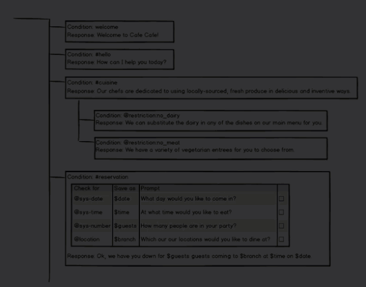

---

copyright:
  years: 2015, 2017
lastupdated: "2017-12-18"

---

{:shortdesc: .shortdesc}
{:new_window: target="_blank"}
{:tip: .tip}
{:pre: .pre}
{:codeblock: .codeblock}
{:screen: .screen}
{:javascript: .ph data-hd-programlang='javascript'}
{:java: .ph data-hd-programlang='java'}
{:python: .ph data-hd-programlang='python'}
{:swift: .ph data-hd-programlang='swift'}
{:table: .aria-labeledby="caption"}

# Creating a dialog
{: #dialog-build}

Use the {{site.data.keyword.conversationshort}} tool to create your dialog.
{: shortdesc}

**BETA** Some of the features described in this documentation are beta features that have been made available for your evaluation. Beta features might be unstable, might change frequently, and might be discontinued with short notice. Beta features also might not provide the same level of performance or compatibility that generally available features provide and are not intended for use in a production environment. Click [here](docs/services/conversation/dialog-build.html) to return to the generally available version of this topic.

## Dialog node limits
{: #dialog-node-limits}

The number of dialog nodes you can create depends on your service plan.

| Service plan     | Dialog nodes per workspace |
|------------------|---------------------------:|
| Standard/Premium |                    100,000 |
| Lite             |                     25,000 |
{: caption="Service plan details" caption-side="top"}

Tree depth limit: Service supports 2,000 dialog node descendants; tooling performs best with 20 or fewer.

## Procedure
{: #dialog-procedure}

To create a dialog, complete the following steps:

1.  Open the **Build** page from the navigation bar, click the **Dialog** tab, and then click **Create**.

    When you open the dialog builder for the first time, the following nodes are created for you:
    - **Welcome**: The first node. It contains a greeting that is displayed to your users when they first engage with the service. You can edit the greeting.
    - **Anything else**: The final node. It contains phrases that are used to reply to users when their input is not recognized. You can replace the responses that are provided or add more responses with a similar meaning to add variety to the conversation. You can also choose whether you want the service to return each response that is defined in turn or return them in random order.
1.  To add more nodes to the dialog tree, click the **More**  icon on the **Welcome** node, and then select **Add node below**.
1.  Enter a condition that, when met, triggers the service to process the node.

    As you begin to define a condition, a box is displayed that shows you your options. You can enter one of the following characters, and then pick a value from the list of options that is displayed.

    <table>
    <caption>Condition builder syntax</caption>
    <tr>
      <th>Character</th>
      <th>Lists defined values for these artifact types</th>
    </tr>
    <tr>
      <td>`#`</td>
      <td>intents</td>
    </tr>
    <tr>
      <td>`@`</td>
      <td>entities</td>
    </tr>
    <tr>
      <td>`@{entity-name}:`</td>
      <td>{entity-name} values</td>
    </tr>
    <tr>
      <td>`$`</td>
      <td>context-variables that you defined or referenced elsewhere in the dialog</td>
    </tr>
    </table>

    You can create a new intent, entity, entity value, or context variable by defining a new condition that uses it. If you create an artifact this way, be sure to go back and complete any other steps that are necessary for the artifact to be created completely, such as defining sample utterances for an intent.

    To define a node that triggers based on more than one condition, enter one condition, and then click the plus sign (+) icon next to it. If you want to apply an `OR` operator to the multiple conditions instead of `AND`, click the `and` that is displayed between the fields to change the operator type. AND operations are executed before OR operations, but you can change the order by using parentheses. For example:
    `$isMember:true AND ($memberlevel:silver OR $memberlevel:gold)`

    The condition you define must be less than 500 characters in length.

    For more information about how to test for values in conditions, see [Conditions](dialog-overview.html#conditions).
1.  **Optional**: If you want to collect multiple pieces of information from the user in this node, then click **Customize** and enable **Slots**. See [Gathering information with slots](dialog-slots.html) for more details.
1.  Enter a response.
    - Add the text that you want the service to display to the user as a response.
    - If you want to define different responses based on certain conditions, then click **Customize** and enable **Multiple responses**.
    - For information about conditional responses or how to add variety to responses, see [Responses](dialog-overview.html##responses).

1.  Specify what to do after the current node is processed. You can choose from the following options:

    - **Wait for user input**: The service pauses until new input is provided by the user.
    - **Skip user input**: The service jumps directly to the first child node. This option is only available if the current node has at least one child node.
    - **Jump to**: The service continues the dialog by processing the node you specify. You can choose whether the service should evaluate the target node's condition or skip directly to the target node's response. See [Configuring the Jump to action](dialog-overview.html#jump-to-config) for more details.

1.  **Optional**: Name the node.

    The dialog node name can contain letters (in Unicode), numbers, spaces, underscores, hyphens, and periods.

    Naming the node makes it easier for you to remember its purpose and to locate the node when it is minimized. If you don't provide a name, the node condition is used as the name.

1.  To add more nodes, select a node in the tree, and then click the **More**  icon.
    - To create a peer node that is checked next if the condition for the existing node is not met, select **Add node below**.
    - To create a peer node that is checked before the condition for the existing node is checked, select **Add node above**.
    - To create a child node to the selected node, select **Add child node**. A child node is processed after its parent node.
    - To copy the current node, select **Duplicate**.

    For more information about the order in which dialog nodes are processed, see [Dialog overview](dialog-overview.html#dialog-flow).
1.  Test the dialog as you build it.
   See [Testing your dialog](#test) for more information.

## Testing your dialog
{: #test}

As you make changes to your dialog, you can test it at any time to see how it responds to input.

1.  From the Dialog tab, click the  icon.
1.  In the chat pane, type some text and then press Enter.

    Make sure the system has finished training on your most recent changes before you start to test the dialog. If the system is still training, a message is displayed in the *Try it out* pane:
    {: tip}

    
1.  Check the response to see if the dialog correctly interpreted your input and chose the appropriate response.

    The chat window indicates what intents and entities were recognized in the input:

    

    In the dialog editor pane, the currently active node is highlighted.
1.  To check or set the value of a context variable, click the **Manage context** link.

    Any context variables that you defined in the dialog are displayed.

    In addition, a `$timezone` context variable is listed. The *Try it out* pane user interface gets user locale information from the web browser and uses it to set the `$timezone` context variable. This context variable makes it easier to deal with time references in test dialog exchanges. Consider doing something similar in your user application. If not specified, Greenwich Mean Time (GMT) is used.

    You can add a variable and set its value to see how the dialog responds in the next test dialog turn. This capability is helpful if, for example, the dialog is set up to show different responses based on a context variable value that is provided by the user.

    1.  To add a context variable, specify the variable name, and press **Enter**.
    1.  To define a default value for the context variable, find the context variable you added in the list, and then specify a value for it.

    See [Context variables](dialog-runtime.html#context) for more information.

1.  Continue to interact with the dialog to see how the conversation flows through it.
    - To find and resubmit a test utterance, you can press the Up key to cycle through your recent inputs.
    - To remove prior test utterances from the chat pane and start over, click the **Clear** link. Not only are the test utterances and responses removed, but this action also clears the values of any context variables that were set as a result of your interactions with the dialog. Context variable values that you explicitly set or change are not cleared.

### What to do next

If you determine that the wrong intents or entities are being recognized, you might need to modify your intent or entity definitions.

If the correct intents and entities are being recognized, but the wrong nodes are being triggered in your dialog, make sure your conditions are written properly.

## Digressions BETA
{: #digressions}

A digression occurs when a user is in the middle of a dialog flow that is designed to address one goal, and abruptly switches topics to initiate a dialog flow that is designed to address a different goal. The dialog has always supported the user's ability to change subjects. If none of the nodes in the dialog branch that is being processed match the goal of the user's latest input, the conversation goes back out to the tree to check the base node conditions for an appropriate match.

The digression settings that are available per node give you the ability to tailor this behavior even more. Namely, you can allow the conversation to return to the dialog flow that was interrupted when the digression occurred. For example, the user might be ordering a new phone, but switches topics to ask about tablets. Your dialog can answer the question about tablets, and then bring the user back to where they left off in the process of ordering a phone. Allowing digressions to occur and return gives your users more control over the flow of the conversation at run time. They can briefly change topics, and then return to where they were before. The result is a dialog flow that more closely simulates a human-to-human conversation.

The following image illustrates the concept of a digression. It shows how a user interacts with dialog nodes that are configured to allow digressions, and return to the dialog flow that was in progress. The user starts to provide the information required to make a dinner reservation. In the middle of filling slots in the #reservation node, the user asks a question about vegetarian menu options. The dialog answers the user's new question by finding a node that addresses it amongst the base nodes (a node that conditions on the #cuisine intent). It then returns to the conversation that was in progress by showing the prompt for the next empty slot from the original dialog node.

You can also limit where digressions are allowed.

- Block users from digressing away from a dialog branch. For example, when a branch has a complex flow that you do not want interrupted.
- Stop users from exiting a node with slots if they are in the middle of filling the slot variables with information you need.
- Prevent a base node from being considered as a possible digression target. See [Disabling digressions into a base node](#disable-digressions) for more details.

### Before you begin

As you test your overall dialog, decide when and where it makes sense to allow digressions and returns from digressions to occur. The following digression controls are applied to the nodes automatically. Only take action if you want to change this default behavior.

- Nodes with slots are configured to prevent digressions away. All other nodes are configured to allow digressions away.
- Every base node in your dialog is configured to allow digressions to target them by default. A child node cannot be the target of a digression.

### Customizing digressions
{: #enable-digressions}

To change the digression behavior for an individual node, complete the following steps:

1.  Click the node to open its edit view.

1.  Click **Customize**, and then click the **Digressions** tab.

    The configuration options differ depending on the whether the node you are editing is a base node, a child node, a node with children, or a node with slots.

    **Digressions away from this node**

    The conversation cannot digress away from a node in the following cases:

    - If any of the child nodes of the current node contain the `anything_else` or `true` condition

      These conditions are special in that they always evaluate to true. Because of their known behavior, they are often used in dialogs to force a parent node to evaluate a specific child node in succession. To prevent breaking the design of the existing dialog flow, digression are not allowed in this case. Before you can enable digressions away from this node, you must change the child node's condition to something else.

    - If the node is configured to jump to another node or skip user input after it is processed

      The final step section of a node specifies what should happen after the node is processed. When the dialog is configured to jump directly to another node, it is often to ensure that a specific sequence is followed. And when the node is configured to skip user input, it is equivalent to forcing the dialog to process the first child node after the current node in succession. To prevent breaking the design of the existing dialog flow, digression are not allowed in either of these cases. Before you can enable digressions away from this node, you must change what is specified in the final step section.

    If the cases listed above do not apply, then you can make the following choices:

    - For all node types, choose whether to allow users to digress away from the current node before they reach the end of the current dialog branch.

    - For all node types that have children, you can decide whether you want the conversation to come back to the current node after a digression if the current node's response has already been displayed. Set the *Allow return from digressions triggered after this node's response* toggle to **No** to prevent the dialog from returning to the current node and continuing to process its branch.

      For example, if the user asks, `Do you sell cupcakes?` and the response, `We offer cupcakes in a variety of flavors and sizes` has been displayed, and then the user changes subjects, you might not want the dialog to return to where it left off. If the child node only captures any possible follow-up questions from the user, then it can safely be ignored.

      However, if the node relies on its child nodes to answer the bulk of the question, then you might want to force the conversation to return and continue processing the nodes in the current branch. For example, the initial response might be, `We offer cupcakes in all shapes and sizes. Which menu do you want to see: gluten-free, dairy-free, or regular?` If the user changes subjects at this point, you might want the dialog to return so the user can pick a menu type and get the information they asked for.

    - For nodes with slots, you can specify whether you want to allow users to digress away from the node before all of the slots are filled. Set the *Allow digressions away while slot filling* toggle to **Yes** to enable digressions away.

      If enabled, when the conversation returns from the digression, the prompt for the next unfilled slot is displayed to encourage the user to continue providing information. If disabled, then any inputs that the user submits which do not contain a value that can fill a slot are ignored. However, you can address unsolicited questions that you anticipate your users might ask while they interact with the node by defining node-level handlers. See [Adding slots](dialog-slots.html#add-slots) for more information.

    - For nodes with slots, you can ensure that the user is only allowed to digress away if they will return to the current node by selecting the **Only digress from slots to nodes that allow returns** checkbox.

      When set, as the dialog looks for a node to answer the user's unrelated question, it does not consider any base nodes that are not configured to allow the dialog to return. Select this checkbox if you want to prevent users from being able to permanently leave the node before they have finished filling the required slots.

    **Digressions into this node**

    You can make the following choices about how digressions into a node behave:

    - You can prevent users from being able to digress into the node. See [Disabling digressions into a base node](#diable-digressions) for more details.

    - When digressions into the node are enabled, you can specify whether the dialog must go back to the dialog flow that it digressed away from after the processing of the current node's branch is finished. To allow the dialog to return afterwards, select **Go back after digression**.

1.  Click **Apply**.

1.  Use the "Try it out" pane to test the digression behavior, and confirm that your dialog functions as expected.

### Disabling digressions into a base node
{: #disable-digressions}

When a flow digresses into a base node, it follows the course of the dialog that is configured for that node. So, it might process a series of child nodes before it reaches the end of the node branch, and then, if configured to do so, goes back to the dialog flow that was interrupted. Through dialog testing, you might find that a base node is triggered too often, or at unexpected times, or that its dialog is too complex and leads the user too far off course to be a good candidate for a temporary digression. If you determine that you would rather not allow users to digress into it, you can configure it to not allow digressions in.

To disable digressions into a base node altogether, complete the following steps:

1.  Click to open the base node that you want to edit.
1.  Click **Customize**, and then click the **Digressions** tab.
1.  Set the *Allow digressions into this node* toggle to **Off**.
1.  Click **Apply**.

### Design considerations
{: #digression-design-considerations}

- **Digression chains**: If a user digresses away from the current node to another node that allows digressions, they could potentially digress away from that other node, and repeat this pattern one or more times again. If all the nodes in the digression chain are configured to go back after the digression, then the user will eventually be brought back to the current dialog node. Test scenarios that digress multiple times to determine whether individual nodes function as expected in this scenario.

- **The current node gets priority**: Remember that nodes outside the current flow are only considered as digression targets if the current flow cannot address the user input. It is even more important in a node with slots that allows digressions away, in particular, to make it clear to users what information is needed from them, and to add confirmation statements that are displayed after the user provides a value.

  Any slot can be filled during the slot-filling process. So, a slot might capture user input unexpectedly. For example, you might have a node with slots that collects the information necessary to make a dinner reservation. One of the slots collects date information. While providing the reservation details, the user might ask, `What's the weather meant to be tomorrow?` You might have a base node that conditions on #forecast which could answer the user. However, because the user's input includes the word `tomorrow` and the reservation node with slots is being processed, the service assumes the user is providing or updating the reservation date instead. *The current node always gets priority.* If you define a clear confirmation statement, such as, `Ok, setting the reservation date to tomorrow,` the user is more likely to realize there was a miscommunication and correct it.

  Conversely, while filling slots, if the user provides a value that is not expected by any of the slots, there is a chance it will match against a completely unrelated base node that the user never intended to digress to.

  Be sure to do lots of testing as you configure the digression behavior.

- **When to use digressions instead of slot node-level handlers**: Use slot node-level handlers to anticipate and address questions that users might ask which are related to the goal of the node with slots specifically. For example, if the node with slots collects the information required to fill out an insurance claim, then you might want to add node-level handlers that address more general questions about insurance claims. However, if an intent is general enough that users might ask about it in multiple contexts, then address it with a base node that allows digressions into it instead. Examples of intents that serve better as digression-enabled base nodes include ones that address questions about how to get additional customer support, or where your stores are located, or about the history of your company.

## Copying a dialog node
{: #copy-node}

You can duplicate a node to create an exact copy of it as a peer node directly below it in the dialog tree. The copied node itself is given the same name as the original node, but with `- copy`*`n`* appended to it, where *`n`* is a number that starts with 1. If you duplicate the same node more than once, then the *`n`* in the name increments by one for each copy to help you distinguish the copies from one another. If the node has no name, it is given the name `copy`*`n`*.

When you duplicate a node that has child nodes, the child nodes are duplicated also. The copied child nodes have the exact same names as the original child nodes. The only way to distinguish a copied child node from an original child node is the `copy` reference in the parent node name.

1.  On the node you want to copy, click the **More**  icon, and then select **Duplicate**.
1.  Consider renaming the copied nodes or editing their conditions to make them distinct.

## Moving a dialog node
{: #move-node}

Each node that you create can be moved elsewhere in the dialog tree.

You might want to move a previously created node to another area of the flow to change the conversation. You can move nodes to become siblings or peers in another branch.

1.  On the node you want to move, click the **More**  icon, and then select **Move**.
1.  Select a target node that is located in the tree near where you want to move this node. Choose whether to place this node before or after the target node, or to make it a child of the target node.

## Finding a dialog node by its node ID
{: #get-node-id}

You might want to find the dialog node that is associated with a known node ID for any of the following reasons:

- You are reviewing logs, and the log refers to a section of the dialog by its node ID.
- You want to map the node IDs listed in the `nodes_visited` property of the API message output to nodes that you can see in your dialog tree.
- A dialog runtime error message informs you about a syntax error, and uses a node ID to identify the node you need to fix.

To discover a node based on its node ID, complete the following steps:

1.  From the Dialog tab of the tooling, select any node in your dialog tree.
1.  Close the edit view if it is open for the current node.
1.  In your web browser's location field, a URL should display that has the following syntax:

    `https://watson-conversation.ng.bluemix.net/space/instance-id/workspaces/workspace-id/build/dialog#node=node-id`

1.  Edit the URL by replacing the current `node-id` value with the ID of the node you want to find, and then submit the new URL.
1.  If necessary, highlight the edited URL again, and resubmit it.

The tooling refreshes, and shifts focus to the dialog node with the node ID that you specified. If the node ID is for a slot, a slot handler, a node-level handler, or a conditional response, then the node in which the slot or conditional response is defined gets focus and the corresponding modal is displayed.

**Note**: If you still cannot find the node, you can export the workspace and use a JSON editor to search the workspace JSON file.
