---

copyright:
  years: 2015, 2017
lastupdated: "2017-11-14"

---

{:shortdesc: .shortdesc}
{:new_window: target="_blank"}
{:tip: .tip}
{:pre: .pre}
{:codeblock: .codeblock}
{:screen: .screen}
{:javascript: .ph data-hd-programlang='javascript'}
{:java: .ph data-hd-programlang='java'}
{:python: .ph data-hd-programlang='python'}
{:swift: .ph data-hd-programlang='swift'}

# Building a dialog
{: #dialog-build}

The dialog uses the intents and entities that are identified in the user's input, plus context from the application, to interact with the user and ultimately provide a useful response.
{: shortdesc}

The response might be the answer to a question such as `Where can I get some gas?` or the execution of a command, such as turning on the radio. The intent and entity might be enough information to identify the correct response, or the dialog might ask the user for more input that is needed to respond correctly. For example, if a user asks, "Where can I get some food?" you might want to clarify whether they want a restaurant or a grocery store, to dine in or take out, and so on. You can ask for more details in a text response and create one or more child nodes to process the new input.

<iframe class="embed-responsive-item" id="youtubeplayer" type="text/html" width="640" height="390" src="https://www.youtube.com/embed/oQUpejt6d84?rel=0" frameborder="0" webkitallowfullscreen mozallowfullscreen allowfullscreen> </iframe>

## Dialog overview
{: #overview}

Your dialog is represented graphically in the tool as a tree. Create a branch to process each intent that you want your conversation to handle. A branch is composed of multiple nodes.

### Dialog nodes

Each dialog node contains, at a minimum, a condition and a response.

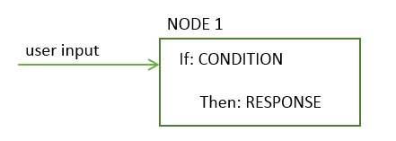

- Condition: Specifies the information that must be present in the user input for this node in the dialog to be triggered. The information might be a specific intent, an entity value, or a context variable value. See [Conditions](#conditions) for more information.
- Response: The utterance that the service uses to respond to the user. The response can also be configured to trigger programmatic actions. See [Responses](#responses) for more information.

You can think of the node as having an if/then construction: if this condition is true, then return this response.

For example, the following node is triggered if the natural language processing function of the service determines that the user input contains the `#cupcake-menu` intent. As a result of the node being triggered, the service responds with an appropriate answer.

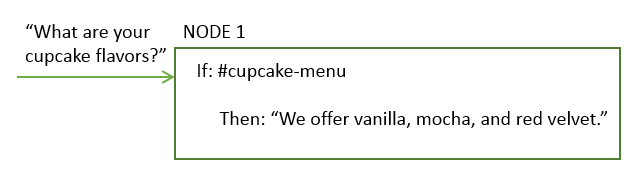

A single node with one condition and response can handle simple user requests. But, more often than not, users have more sophisticated questions or want help with more complex tasks. You can add child nodes that ask the user to provide any additional information that the service needs.

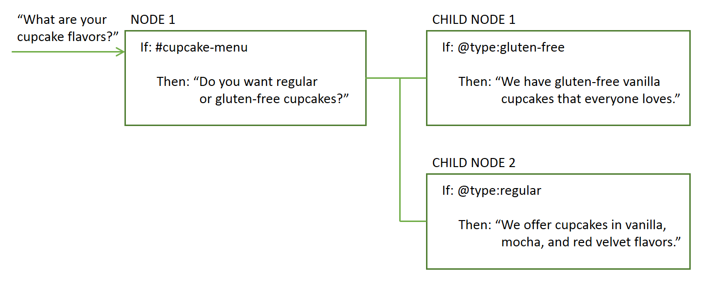

### Dialog flow

The dialog that you create is processed by the service from top to bottom.

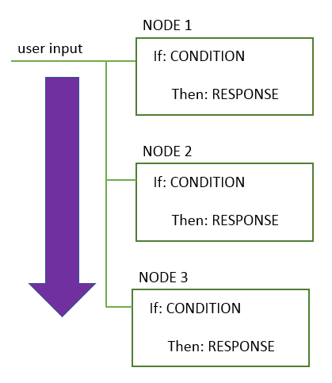

As it travels down the tree, if the service finds a condition that is met, it triggers that node. It then moves from left to right on the triggered node to check the user input against any child node conditions. As it checks the child nodes it moves again from top to bottom.

The services continues to work its way through the dialog tree from top to bottom, left to right, then top to bottom and left to right until it reaches the last node in the branch it is following.

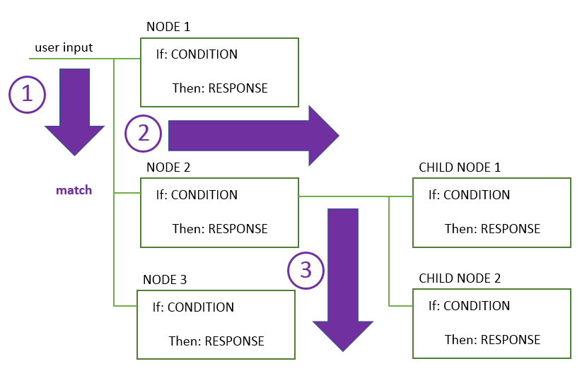

When you start to build the dialog, you must determine the branches to include, and where to place them. The order of the branches is important because nodes are evaluated from top to bottom. The first base node whose condition matches the input is used; any nodes that come lower in the tree are not triggered.

## Conditions
{: #conditions}

A node condition determines whether that node is used in the conversation. Response conditions determine which response to display to a user.
You can use one or more of the following artifacts in any combination to define a condition:

- **Context variable**: The node is used if the context variable expression that you specify is true. Use the syntax `$variable_name:value` or `$variable_name == 'value'`. See [Context variables](#context).

  Do not define a node or response condition based on the value of a context variable in the same dialog node in which you set the context variable value.
  {: tip}

- **Entity**: The node is used when any value or synonym for the entity is recognized in the user input. Use the syntax `@entity_name`. For example `@city`.

  Be sure to create a peer node to handle the case where none of the entity's values or synonyms are recognized.
  {: tip}

- **Entity value**: The node is used if the entity value is detected in the user input. Use the syntax `@entity_name:value`. For example: `@city:Boston`. Specify a defined value for the entity, not a synonym.

  If you check for the presence of the entity, without specifying a particular value for it, in a peer node, be sure to place the node that checks for this particular entity value above it.
{: tip}

- **Intent**: The simplest condition is a single intent. The node is used if the user's input maps to that intent. Use the sytnax `#intent-name`. For example, `#weather` checks if the intent detected in the user input is `weather`. If so, the node is processed.

- **Special condition**: Conditions that are provided with the service that you can use to perform common dialog functions.

  <table>
  <tr>
    <td>Condition name</td>
    <td>Description</td>
  </tr>
  <tr>
    <td>anything_else</td>
    <td>You can use this condition at the end of a dialog, to be processed when the user input does not match any other dialog nodes. The **Anything else** node is triggered by this condition.</td>
  </tr>
  <tr>
    <td>conversation_start</td>
    <td>Like **welcome**, this condition is evaluated as true during the first dialog turn. Unlike **welcome**, it is true whether or not the initial request from the application contains user input. A node with the **conversation_start** condition can be used to initialize context variables or perform other tasks at the beginning of the dialog.</td>
  </tr>
  <tr>
    <td>false</td>
    <td>This condition is always evaluated to false. You might use this at the top of a branch that is under development, to prevent it from being used, or as the condition for a node that provides a common function and is used only as the target of a **Jump to** action.</td>
  </tr>
  <tr>
    <td>irrelevant</td>
    <td>This condition will evaluate to true if the user’s input is determined to be irrelevant by the Conversation service.</td>
  </tr>
  <tr>
    <td>true</td>
    <td>This condition is always evaluated to true. You can use it at the end of a list of nodes or responses to catch any responses that did not match any of the previous conditions.</td>
  </tr>
  <tr>
    <td>welcome</td>
    <td>This condition is evaluated as true during the first dialog turn (when the conversation starts), only if the initial request from the application does not contain any user input. It is evaluated as false in all subsequent dialog turns. The **Welcome** node is triggered by this condition. Typically, a node with this condition is used to greet the user, for example, to display a message such as "Welcome to our Pizza ordering app."</td>
  </tr>
  </table>

### Condition syntax

Use one of these syntax options to create valid expressions in conditions:

- Spring Expression (SpEL) language, which is an expression language that supports querying and manipulating an object graph at runtime. See [Spring Expression Language (SpEL) language ](http://docs.spring.io/spring/docs/current/spring-framework-reference/html/expressions.html){: new_window} for more information.

- Shorthand notations to refer to intents, entities, and context variables. See [Accessing and evaluating objects](expression-language.html).

Use regular expressions to check for values to condition against.  To find a matching string, for example, you can use the `String.find` method. See  [Methods](dialog-methods.html) for more details.

### Condition usage tips

- If you want to evaluate only the value of the first detected instance of an entity type, you can use the syntax  `@entity == 'specific-value'` instead of the `@entity:(specific-value)` format. For example, when you use `@appliance == 'air conditioner'`, you are evaluating only the value of the first detected `@appliance` entity. But, using `@appliance:(air conditioner)` gets expanded to `entity['appliance'].contains('air conditioner')`, which matches whenever there is at least one `@appliance` entity of value 'air conditioner' detected in the user input.
- When using numeric variables, make sure the variables have values. If a variable does not have a value, it is treated as having a null value (0) in a numeric comparison. For example, if you check the value of a variable with the condition `@price < 100`, and the @price entity is null, then the condition is evaluated as `true` because 0 is less than 100, even though the price was never set. To prevent the checking of null variables, use a condition such as `@price AND @price < 100`. If @price has no value, then this condition correctly returns false.
- If you use an entity as the condition and fuzzy matching is enabled, then `@entity_name` evaluates to true only if the confidence of the match is greater than 30%. That is, only if `@entity_name.confidence > .3`.

## Responses
{: #responses}

The dialog response defines how to reply to the user.

You can reply with one of these response types:

- [Simple text response](#simple-text)
- [Conditional responses](#multiple)
- [Complex response](#complex)

### Simple text response
{: #simple-text}

If you want to provide a text response, simply enter the text that you want the service to display to the user.


#### Adding variety
{: #variety}

If your users return to your conversation service frequently, they might be bored to hear the same greetings and responses every time.  You can add *variations* to your responses so that your conversation can respond to the same condition in different ways.

<iframe class="embed-responsive-item" id="youtubeplayer" type="text/html" width="640" height="390" src="https://www.youtube.com/embed/nAlIW3YPrAs?rel=0" frameborder="0" webkitallowfullscreen mozallowfullscreen allowfullscreen> </iframe>

In this example, the answer that the service provides in response to questions about store locations differs from one interaction to the next:

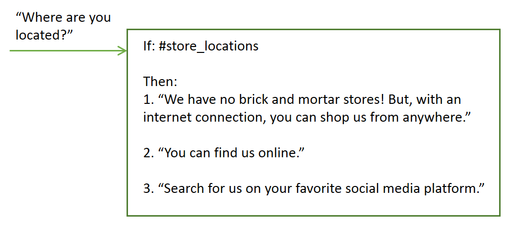

You can choose to rotate through the response variations sequentially or in random order. By default, responses are rotated sequentially, as if they were chosen from an ordered list.

### Conditional responses
{: #multiple}

A single dialog node can provide different responses, each one triggered by a different condition.  Use this approach to address multiple scenarios in a single node.

<iframe class="embed-responsive-item" id="youtubeplayer" type="text/html" width="640" height="390" src="https://www.youtube.com/embed/KcvVQAsnhLM?rel=0" frameborder="0" webkitallowfullscreen mozallowfullscreen allowfullscreen> </iframe>

The node still has a main condition, which is the condition for using the node and processing the conditions and responses that it contains.

In this example, the service uses information that it collected earlier about the user's location to tailor its response, and provide information about the store nearest the user. See [Context variables](#context) for more information about how to store information collected from the user.


This single node now provides the equivalent function of four separate nodes.

To add conditional responses to a node, click **Customize** and then click the **Multiple responses** toggle to turn it **On**.

The conditions within a node are evaluated in order, just as nodes are.  Be sure that your conditions and responses are listed in the correct order.  If you need to change the order, select a condition and move it up or down in the list using the arrows that are displayed. If you want to update the context, you must do so in the JSON editor for each individual response.  There is not a common JSON editor for all responses. If you associated a **Jump to** action with the node, the jump does not occur until after any responses are processed.
{: tip}

### A complex response
{: #complex}

To specify a more complex response, you can use the JSON editor to specify the response in the `"output":{}` property.

To include a context variable value in the response, use the syntax `$variable-name` to specify it. See [Context variables](#context) for more information.

```json
{
  "output": {
    "text": "Hello $user"
  }
}
```
{: codeblock}

To specify more than one statement that you want to display on separate lines, define the output as a JSON array.

```json
{
  "output": {
    "text": ["Hello there.", "How are you?"]
  }
}
```
{: codeblock}

The first sentence is displayed on one line, and the second sentence is displayed as a new line below it.

To implement more complex behavior, you can define the output text as a complex JSON object. For example, you can use a complex object in the JSON output to mimic the behavior of adding response variations to the node. You can include the following properties in the complex object:

- **values**: A JSON array of strings that holds multiple versions of output text that this dialog node can return. The order in which values in the array are returned depends on the attribute `selection_policy`.

- **selection_policy**: The following values are valid:

    - **random**: The system randomly selects output text from the `values` array and does not repeat them consecutively. For example, consider output.text that contains three values. For the first three times, a random value is selected but not repeated another time. After all the output values are given, the system randomly selects another value and repeats the process.

        ```json
        {
            "output":{
                "text":{
                    "values":["Hello.","Hi.","Howdy!"],
                    "selection_policy":"random"
                }
            }
        }
        ```
        {: codeblock}

    The system returns one greeting from these three options that it picks at random. The next time the response is triggered, another greeting from the list is displayed. The greeting is again chosen at random, except the previously used greeting is intentionally not repeated.

    - **sequential**: The system returns the first output text the first time the dialog node is triggered, the second output text the second time the node is triggered, and so on.

        ```json
        {
            "output":{
                "text":{
                    "values":["Hello.", "Hi.", "Howdy!"],
                    "selection_policy":"sequential"
                }
            }
        }
        ```
        {: codeblock}

- **append**: Specifies whether to append a value to an array or overwrite the values in the array with the new value or values. When set to false, the output collected in previously executed dialog nodes is overwritten by the text value specified in this particular node.

    ```json
    {
        "output":{
            "text":{
                "values": ["Hello."],
                "append":false
            }
        }
    }
    ```
    {: codeblock}

    In this case, all other output text is overwritten by this output text.

The default behavior assumes `selection_policy = random` and `append = true`. When the values array contains more than one item, the output text is randomly selected from its elements.

### Defining what to do next
{: #jump-to}

After making the specified response, you can instruct the service to do one of the following things:

- **Wait for user input**: The service waits for the user to provide new input that the response elicits. For example, the response might ask the user a yes or no question. The dialog will not progress until the user provides more input.
- **Skip user input**:  Use this option when you want to bypass waiting for user input and go directly to the first child node of the current node instead.

  **Note**: The current node must have at least one child node for this option to be available.

- **Jump to another dialog node**: Use this option when you want to bypass waiting for user input and want the conversation to go directly to an entirely different dialog node. You can use a *Jump to* action to route the flow to a common dialog node from multiple locations in the tree, for example.

  **Note**: The target node that you want to jump to must exist before you can configure the jump to action to use it.

#### Configuring the Jump to action
{: #jump-to-config}

If you choose to jump to another node, you must specify whether the action targets the **response** or the **condition** of the selected dialog node.

- **Response**: If the statement targets the response section of the selected dialog node, it is run immediately. That is, the system does not evaluate the condition of the selected dialog node; it processes the response of the selected dialog node immediately.

  Targeting the response is useful for chaining several dialog nodes together. The response is processed as if the condition of this dialog node is true. If the selected dialog node has another **Jump to** action, that action is run immediately, too.

- **Condition**: If the statement targets the condition section of the selected dialog node, the service checks first whether the condition of the targeted node evaluates to true.
    - If the condition evaluates to true, the system processes the target node immediately.
    - If the condition does not evaluate to true, the system moves to the next sibling node of the target node to evaluate its condition, and repeats this process until it finds a dialog node with a condition that evaluates to true.
    - If the system processes all the siblings and none of the conditions evaluate to true, the basic fallback strategy is used, and the dialog evaluates the nodes at the base level of the dialog tree.

    Targeting the condition is useful for chaining the conditions of dialog nodes. For example, you might want to first check whether the input contains an intent, such as `#turn_on`, and if it does, you might want to check whether the input contains entities, such as `@lights`, `@radio`, or `@wipers`. Chaining conditions helps to structure larger dialog trees.

**Note**: The processing of **Jump to** actions changed with the February 3, 2017 release. See [Upgrading your workspace ](upgrading.html){: new_window} for more details.

#### More information

For information about the expression language used by dialog, plus methods, system entities, and other useful details, see the **Reference** section in the navigation pane.

## Context variables
{: #context}

The dialog is stateless, meaning that it does not retain information from one interchange with the user to the next. Your application is responsible for maintaining any continuing information that it needs. However, the application can pass information to the dialog, and the dialog can update this information and pass it back to the application. It does so by using context variables.

A context variable is a variable that you define in a node, and optionally specify a default value for. Other nodes or application logic can subsequently set or change the value of the context variable. 

You can condition against context variable values by referencing a context variable from a dialog node condition to determine whether to execute a node. And you can reference a context variable from dialog node response conditions to show different reponses depending on a value provided by an external service or by the user.

### Passing context from the application

Pass information from the application to the dialog by setting a context variable and passing the context variable to the dialog.

For example, your application can set a $time_of_day context variable, and pass it to the dialog which can use the information to tailor the greeting it displays to the user.

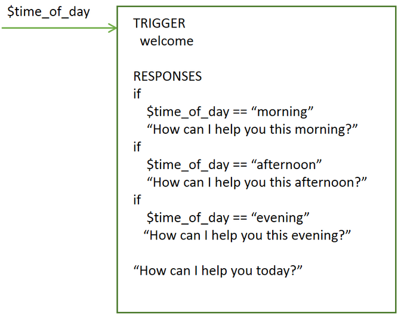

In this example, the dialog knows that the application sets the variable to one of these values: *morning*, *afternoon*, or *evening*. It can check for each value, and depending on which value is present, return the appropriate greeting. If the variable is not passed or has a value that does not match one of the expected values, then a more generic greeting is displayed to the user.

### Passing context from node to node

The dialog can also add context variables to pass information from one node to another or to update the values of context variables. As the dialog asks for and gets information from the user, it can keep track of the information and reference it later in the conversation.

For example, in one node you might ask users for their name, and in a later node address them by name.

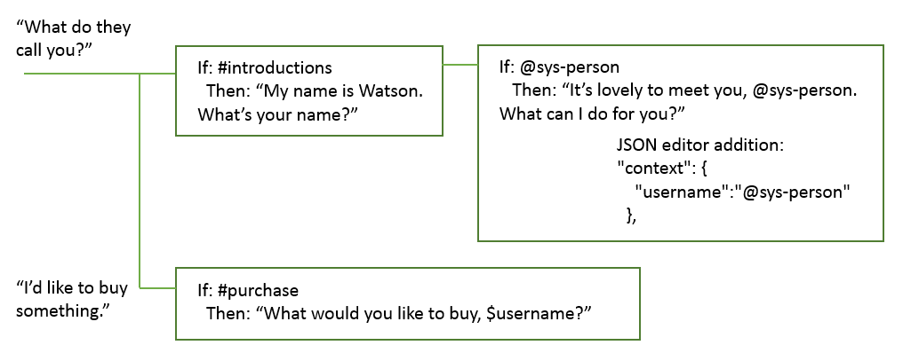

In this example, the system entity @sys-person is used to extract the user's name from the input if the user provides one. In the JSON editor, the username context variable is defined and set to the @sys-person value. In a subsequent node, the $username context variable is included in the response to address the user by name.

### Defining a context variable

Define a context variable by adding a `name` and `value` pair to the `{context}` section of the JSON dialog node definition. The pair must meet these requirements:

- The `name` can contain any upper- and lowercase alphabetic characters, numeric characters (0-9), and underscores.

  **Note**: You can include other characters, such as periods and hyphens, in the name. However, if you do, then you must use one of the following approaches to reference the variable:
  - context['variable-name']: The full SpEL expression syntax.
  - $(variable-name): Shorthand syntax with the variable name enclosed in parentheses.

  See [Accessing and evaluating objects](expression-language.html#shorthand-syntax-for-context-variables) for more details.

- The `value` can be any supported JSON type, such as a simple string variable, a number, a JSON array, or a JSON object.

The following JSON sample defines values for the $dessert string, $toppings_array array, and $age number context variables:

```json
{
  "context": {
    "dessert": "ice-cream",
    "toppings_array": ["onion", "olives"],
    "age": 18
  }
}
```
{: codeblock}

To define a context variable, complete the following steps:

1.  You define the context variable in a JSON editor.

    The editor is surfaced in multiple places in the dialog node edit view. Where it surfaces reflects the time at which the variable will be set during dialog node evaluation.

    -To add a context variable that is processed after the node response is processed, click the **Edit response**  icon. Click the **Options**   icon that is displayed in the response section, and then click **Open JSON editor**.

    If the **Multiple responses** setting is disabled for the node, then you do not need to click the **Edit response** icon first.
    {:tip}

    -To add a context variable that is processed after a slot condition is met, click the **Edit slot**  icon. From the *Configure slot* view header, click the **Options**  icon, and then click **Open JSON editor**. (For more information about slots, see [Gathering information with slots](dialog-build.html#slots).)

    -To add a context variable that is processed after a slot response condition is met, click the **Edit slot**  icon. Click the **Options**  icon in the response section, and then click **Open JSON editor**.

    If the **Enable conditional responses** setting is enabled for the slot, then you must click the **Edit response**  icon before you will see the **Options**  icon in the response section.
    {: tip}

1.  Add a `"context":{}` block if one is not present.

    ```json
    {
      "context":{},
      "output":{}
    }
    ```
    {: codeblock}

1.  In the context block, add a name and value pair for each context variable that you want to define.

    ```json
    {
      "context":{
        "name": "value"
    },
      "output": {}
    }
    ```
    {: codeblock}

    In this example, a variable named `new_variable` is added to a context block that already contains a variable.
    ```json
    {
      "context":{
        "existing_variable": "value",
        "new_variable":"value"
    }
    }
    ```
    {: codeblock}

  To subsequently reference the context variable, use the syntax `$name` where *name* is the name of the context variable that you defined. For example, `$new_variable`.

Other common tasks include:

- To store the entire string that was provided by the user as input, use `input.text`:

    ```json
    {
      "context": {
        "repeat": "<?input.text?>"
      }
    }
    ```
    {: codeblock}

- To store the value of an entity in a context variable, use this syntax:

    ```json
    {
      "context": {
        "place": "@place"
      }
    }
    ```
    {: codeblock}

- To store in a context variable the value of a string that you extract from the user's input by using a regular expression, use this syntax:

    ```json
    {
      "context": {
         "number": "<?input.text.extract('^[^\\d]*[\\d]{11}[^\\d]*$',0)?>"
      }
    }
    ```
    {: codeblock}

- To store the value of a pattern entity in a context variable, append .literal to the entity name. Using this syntax ensures that the exact span of text from user input that matched the specified pattern is stored in the variable.

    ```json
    {
      "context": {
        "email": "@email.literal"
      }
    }
    ```
    {: codeblock}

### Order of operation
{: #order-of-context-var-ops}

The order in which you define the context variables does not determine the order in which they are evaluated by the service. The service evaluates the variables, which are defined as JSON name and value pairs, in random order. Do not set a value in the first context variable and expect to be able to use it in the second, because there is no guarantee that the first context variable in your list will be executed before the second one in your list. For example, do not use two context variables to implement logic that returns a random number between zero and some higher value that is passed to the node.

```json
"context": {
    "upper": "<? @sys-number.numeric_value + 1?>",
    "answer": "<? new Random().nextInt($upper) ?>"
}
```
{: codeblock}

Use a slightly more complex expression to avoid having to rely on the value of the $upper context variable being evaluated before the $answer context variable is evaluated.

```json
"context": {
    "answer": "<? new Random().nextInt(@sys-number.numeric_value + 1) ?>"
}
```
{: codeblock}

### Updating a context variable value
{: #updating-a-context-variable-value}

If a node sets the value of a context variable that is already set, then the previous value is overwritten.

#### Updating a complex JSON object

Previous values are overwritten for all JSON types except a JSON object. If the context variable is a complex type such as JSON object, a JSON merge procedure is used to update the variable. The merge operation adds any newly defined properties and overwrites any existing properties of the object.

In this example, a name context variable is defined as a complex object.

```json
{
  "context": {
    "complex_object": {
      "user_firstname" : "Paul",
      "user_lastname" : "Pan",
      "has_card" : false
    }
  }
}
```
{: codeblock}

A dialog node updates the context variable JSON object with the following values:

```json
{
  "complex_object": {
    "user_firstname": "Peter",
    "has_card": true
  }
}
```
{: codeblock}

The result is this context:

```json
{
  "complex_object": {
    "user_firstname": "Peter",
    "user_lastname": "Pan",
    "has_card": true
  }
}
```
{: codeblock}

#### Updating arrays

If your dialog context data contains an array of values, you can update the array by appending values, removing a value, or replacing all the values.

Choose one of these actions to update the array. In each case, we see the array before the action, the action, and the array after the action has been applied.

- **Append**: To add values to the end of an array, use the `append` method.

    For this Dialog runtime context:

    ```json
    {
      "context": {
        "toppings_array": ["onion", "olives"]
      }
    }
    ```
    {: codeblock}

    Make this update:

    ```json
    {
      "context": {
        "toppings_array": "<? $toppings_array.append('ketchup', 'tomatoes') ?>"
      }
    }
    ```
    {: codeblock}

    Result:

    ```json
    {
      "context": {
        "toppings_array": ["onion", "olives", "ketchup", "tomatoes"]
      }
    }
    ```
    {: codeblock}

- **Remove**: To remove an element, use the `remove` method and specify its value or position in the array.

    - **Remove by value** removes an element from an array by its value.

        For this Dialog runtime context:

        ```json
        {
          "context": {
            "toppings_array": ["onion", "olives"]
          }
        }
        ```
        {: codeblock}

        Make this update:

        ```json
        {
          "context": {
            "toppings_array": "<? $toppings_array.removeValue('onion') ?>"
          }
        }
        ```
        {: codeblock}

        Result:

        ```json
        {
          "context": {
            "toppings_array": ["olives"]
          }
        }
        ```
        {: codeblock}

    - **Remove by position**: Removing an element from an array by its index position:

        For this Dialog runtime context:

        ```json
        {
          "context": {
            "toppings_array": ["onion", "olives"]
          }
        }
        ```
        {: codeblock}

        Make this update:

        ```json
        {
          "context": {
            "toppings_array": "<? $toppings_array.remove(0) ?>"
          }
        }
        ```
        {: codeblock}

        Result:

        ```json
        {
          "context": {
            "toppings_array": ["olives"]
          }
        }
        ```
        {: codeblock}

- **Overwrite**: To overwrite the values in an array, simply set the array to the new values:

    For this Dialog runtime context:

        ```json
        {
          "context": {
            "toppings_array": ["onion", "olives"]
          }
        }
        ```
        {: codeblock}

    Make this update:

        ```json
        {
          "context": {
            "toppings_array": ["ketchup", "tomatoes"]
          }
        }
        ```
        {: codeblock}

    Result:

        ```json
        {
          "context": {
            "toppings_array": ["ketchup", "tomatoes"]
          }
        }
        ```
        {: codeblock}

**Attention**: If you save the array as part of a string, it becomes a String object instead of an Array. For example, the following $array context variable is an array, but the $string_array context variable is a string.

```json
{
  "context": {
    "array": [
      "one",
      "two"
    ],
    "array_in_string": "this is my array: $array"
  }
}
```
{: codeblock}

If you check the values of these context variables in the Try it out pane, you will see their values specified as follows:

**$array** : `["one","two"]`

**$array_in_string** : `"this is my array: [\"one\",\"two\"]"`

You can subsequently perform array methods on the $array variable, such as `<? $array.removeValue('two') ?>` but not the $array_in_string variable.

## Creating a dialog
{: #create}

Use the {{site.data.keyword.conversationshort}} tool to create a dialog.

### Dialog node limits
{: #dialog-node-limits}

The number of dialog nodes you can create depends on your service plan.

| Service plan     | Dialog nodes per workspace |
|------------------|---------------------------:|
| Standard/Premium |                    100,000 |
| Lite             |                     25,000 |

Tree depth limit: Service supports 2,000 dialog node descendants; tooling performs best with 20 or fewer.

### Procedure

To create a dialog, complete the following steps:

1.  Open the **Build** page from the navigation bar, click the **Dialog** tab, and then click **Create**.

    When you open the dialog builder for the first time, the following nodes are created for you:
    - **Welcome**: The first node. It contains a greeting that is displayed to your users when they first engage with the service. You can edit the greeting.
    - **Anything else**: The final node. It contains phrases that are used to reply to users when their input is not recognized. You can replace the responses that are provided or add more responses with a similar meaning to add variety to the conversation. You can also choose whether you want the service to return each response that is defined in turn or return them in random order.
1.  To add more nodes to the dialog tree, click the **More**  icon on the **Welcome** node, and then select **Add node below**.
1.  Enter a condition that, when met, triggers the service to process the node.

    As you begin to define a condition, a box is displayed that shows you your options. You can enter one of the following characters, and then pick a value from the list of options that is displayed.

    <table>
    <tr>
      <td>Character</td>
      <td>Lists defined values for these artifact types</td>
    </tr>
    <tr>
      <td>`#`</td>
      <td>intents</td>
    </tr>
    <tr>
      <td>`@`</td>
      <td>entities</td>
    </tr>
    <tr>
      <td>`@{entity-name}:`</td>
      <td>{entity-name} values</td>
    </tr>
    <tr>
      <td>`$`</td>
      <td>context-variables that you defined or referenced elsewhere in the dialog</td>
    </tr>
    </table>

    You can create a new intent, entity, entity value, or context variable by defining a new condition that uses it. If you create an artifact this way, be sure to go back and complete any other steps that are necessary for the artifact to be created completely, such as defining sample utterances for an intent.

    To define a node that triggers based on more than one condition, enter one condition, and then click the plus sign (+) icon next to it. If you want to apply an `OR` operator to the multiple conditions instead of `AND`, click the `and` that is displayed between the fields to change the operator type. AND operations are executed before OR operations, but you can change the order by using parentheses. For example:
    `$isMember:true AND ($memberlevel:silver OR $memberlevel:gold)`

    The condition you define must be less than 500 characters in length.

    For more information about how to test for values in conditions, see [Conditions](#conditions).
1.  **Optional**: If you want to collect multiple pieces of information from the user in this node, then click **Customize** and enable **Slots**. See [Gathering information with slots](#slots) for more details.
1.  Enter a response.
    - Add the text that you want the service to display to the user as a response.
    - If you want to define different responses based on certain conditions, then click **Customize** and enable **Multiple responses**.
    - For information about conditional responses or how to add variety to responses, see [Responses](#responses).

1.  Specify what to do after the current node is processed. You can choose from the following options:

    - **Wait for user input**: The service pauses until new input is provided by the user.
    - **Skip user input**: The service jumps directly to the first child node. This option is only available if the current node has at least one child node.
    - **Jump to**: The service continues the dialog by processing the node you specify. You can choose whether the service should evaluate the target node's condition or skip directly to the target node's response. See [Configuring the Jump to action](dialog-build.html#jump-to-config) for more details.

1.  **Optional**: Name the node.

    The dialog node name can contain letters (in Unicode), numbers, spaces, underscores, hyphens, and periods.

    Naming the node makes it easier for you to remember its purpose and to locate the node when it is minimized. If you don't provide a name, the node condition is used as the name.

1.  To add more nodes, select a node in the tree, and then click the **More**  icon.
    - To create a peer node that is checked next if the condition for the existing node is not met, select **Add node below**.
    - To create a peer node that is checked before the condition for the existing node is checked, select **Add node above**.
    - To create a child node to the selected node, select **Add child node**. A child node is processed after its parent node.

    For more information about the order in which dialog nodes are processed, see [Dialog overview](#overview).
1.  Test the dialog as you build it.
   See [Testing your dialog](#test) for more information.

## Gathering information with slots
{: #slots}

Add slots to a dialog node to gather multiple pieces of information from a user within that node. Slots collect information at the users' pace. Details the user provides upfront are saved, and the service asks only for the details they do not.

<iframe class="embed-responsive-item" id="youtubeplayer" type="text/html" width="640" height="390" src="https://www.youtube.com/embed/ES4GHcDsSCI?rel=0" frameborder="0" webkitallowfullscreen mozallowfullscreen allowfullscreen> </iframe>

Learn more:
- [Why add slots?](dialog-build.html#why-add-slots)
- [Adding slots](dialog-build.html#add-slots)
- [Tips](dialog-build.html#slots-tips)

### Why add slots?
{: #why-add-slots}

Use slots to get the information you need before you can respond accurately to the user. For example, if users ask about operating hours, but the hours differ by store location, you could ask a follow-up question about which store location they plan to visit before you answer. You can then add response conditions that take the provided location information into account.


Slots can help you to collect multiple pieces of information that you need to complete a complex task for a user, such as making a dinner reservation.

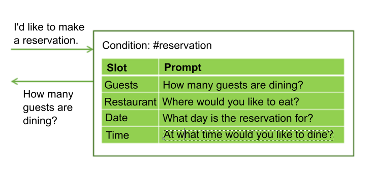

The user might provide values for mutliple slots at once. For example, the input might include the information, "There will be 6 of us dining at 7 PM." This one input contains two of the missing required values: the number of guests and time of the reservation. The service recognizes and stores both of them, each one in its corresponding slot. It then displays the prompt that is associated with the next empty slot.


Slots make it possible for the service to answer follow-up questions without having to re-establish the user's goal. For example, a user might ask for a weather forecast, then ask a follow-up question about weather in another location or on a different day. If you save the required forecast variables, such as location and day, in slots, then if a user asks a follow-up question with new variable values, you can overwrite the slot values with the new values provided, and give a response that reflects the new information.

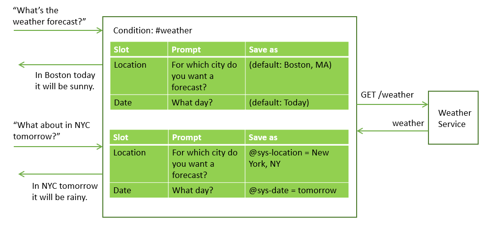

Using slots produces a more natural dialog flow between the user and the service, and is easier for you to manage than trying to collect the information by using many separate nodes.

#### Adding slots
{: #add-slots}

1.  Identify the units of information that you want to collect. For example, to order a pizza for someone, you might want to collect the following information:

    - Delivery time
    - Size

1.  From the dialog node edit view, click **Customize**, and then click the toggle next to **Slots** to turn it **On**.

    **Note**: For more information about the **Prompt for everything** checkbox, see [Asking for everything at once](dialog-build.html#slots-prompt-for-everything).

1.  **Add a slot for each unit of required information**. For each slot, specify these details:

    - **Check for**: Identify the type of information you want to extract from the user's response to the slot prompt. In most cases, you check for entity values, but you can also check for an intent. You can use AND and OR operators here to define more complex conditions.

      **Note**: If the entity has regular expression patterns defined for it, then after adding the entity name, append `.literal` to it. For example, after you choose `@email` from the list of defined entities, edit the *Check for* field to contain `@email.literal`. By adding the `.literal` property, you indicate that you want to capture the exact text that was entered by the user and was identified as an email address based on its pattern.

      Avoid checking for context variable values. The *Check for* value is first used as a condition, but then becomes the value of the context variable that you name in the *Save as* field. If you use a context variable in the condition, it can lead to unexpected behavior when it gets used in the context.
      {: tip}

    - **Save as**: Provide a name for the context variable in which to store the value of interest from the user's response to the slot prompt. Do not specify a context variable that is used earlier in the dialog, and therefor might have a value. It is only when the context variable for the slot is null that the prompt for the slot is displayed.

    - **Prompt**: Write a statement that elicits the piece of the information you need from the user. After displaying this prompt, the conversation pauses and the service waits for the user to respond.

    - If you want different follow-up statements to be shown based on whether the user provides the information you need in response to the initial slot prompt, you can edit the slot (by clicking the **Edit slot**  icon) and define them:

      - **Found**: Displayed after the user provides the expected information.

      - **Not found**: Displayed if the information provided by the user is not understood, or is not provided in the expected format. If the slot is filled successfully, or the user input is understood and handled by a node-level handler, then this statement is never displayed.

      For information about how to define conditions and associated actions for Found and Not found responses, see [Adding conditions to Found and Not found responses](dialog-build.html#slot-handler-next-steps).

    This table shows example slot values for a node that helps users place a pizza order.

    <table>
    <tr>
      <td>Information</td>
      <td>Check for</td>
      <td>Save as</td>
      <td>Prompt</td>
      <td>Follow-up if found</td>
      <td>Follow-up if not found</td>
    </tr>
    <tr>
      <td>Size</td>
      <td>@size</td>
      <td>$size</td>
      <td>"What size pizza would you like?"</td>
      <td>"$size it is."</td>
      <td>"What size did you want? We have small, medium, and large."</td>
    </tr>
    <tr>
      <td>DeliverBy</td>
      <td>@sys-time</td>
      <td>$time</td>
      <td>"When do you need the pizza by?"</td>
      <td>"For delivery by $time."</td>
      <td>"What time did you want it delivered? We need at least a half hour to prepare it."</td>
    </tr>
    </table>

1.  **Make a slot optional or disable it under certain conditions**. You can optionally configure a slot in these ways:

    - **Optional**: To make a slot optional, add a slot without a prompt. The service does not ask the user for the information, but it does look for the information in the user input, and saves the value if the user provides it. For example, you might add a slot that captures dietary restriction informations in case the user specifies any. However, you don't want to ask all users for dietary information since it is irrelevant in most cases.

      <table>
      <tr>
        <td>Information</td>
        <td>Check for</td>
        <td>Save as</td>
      </tr>
      <tr>
        <td>Wheat restriction</td>
        <td>@dietary</td>
        <td>$dietary</td>
      </tr>
      </table>

      If you make a slot optional, only reference its context variable in the node-level response text if you can word it such that it makes sense even if no value is provided for the slot. For example, you might word a summary statement like this, "I am ordering a $size $dietary pizza for delivery at $time." The resulting text makes sense whether the dietary restriction information, such as `gluten-free` or `dairy-free`, is provided or not. The result is either, "I am ordering a large gluten-free pizza for delivery at 3:00PM." or "I am ordering a large pizza for delivery at 3:00PM."
      {: tip}

    - **Conditional**: If you want a slot to be enabled only under certain conditions, then you can add a condition to it. For example, if slot 1 asks for a meeting start time, slot 2 captures the meeting duration, and slot 3 captures the end time, then you might want to enable slot 3 (and ask for the meeting end time) only if a value for slot 2 is not provided. To make a slot conditional, edit the slot, and then from the **More**  menu, select **Enable condition**. Define the condition that must be met for the slot to be enabled.

      You can condition on the value of a context variable from an earlier slot because the order in which the slots are listed is the order in which they are evaluated. However, only condition on a slot context variable value that you can be confident will exist when this slot is evaluated. Make sure the earlier slot is required, for example.
    {: tip}
1.  **Keep users on track**. You can optionally define node-level handlers that provide responses to questions users might ask during the interaction that are tangential to the purpose of the node.

    For example, the user might ask about the tomato sauce recipe or where you get your ingredients. To handle such digressions, click the **Manage handlers** link and add a condition and response for each anticipated question.

    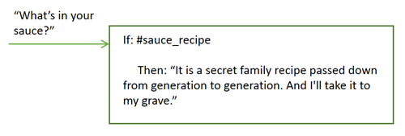

    After responding to the digression, the prompt associated with the current empty slot is displayed.

    This condition is triggered if the user provides input that matches the handler conditions at any time during the dialog node flow up until the node-level response is displayed. See [Handling requests to exit a process](dialog-build.html#slots-node-level-handler) for more ways to use the node-level handler.
1.  **Add a node-level response**. The node-level response is not executed until after all of the required slots are filled. You can add a response that summarizes the information you collected. For example, "A `$size` pizza is scheduled for delivery at `$time`. Enjoy!"

    If you want to define different responses based on certain conditions, click **Customize**, and then click the **Multiple responses** toggle to turn it **On**. For information about conditional responses, see [Conditional responses](dialog-build.html#multiple).
1.  **Add logic that resets the slot context variables**. As you collect answers from the user per slot, they are saved in context variables. You can use the context variables to pass the information to another node or to an application or external service for use. However, after passing the information, you must set the context variables to null to reset the node so it can start collecting information again. You cannot null the context variables within the current node because the service will not exit the node until the required slots are filled. Instead, consider using one of the following methods:
    - Add processing to the external application that nulls the variables.
    - Add a child node that nulls the variables.
    - Insert a parent node that nulls the variables, and then jumps to the node with slots.

#### Slots usage tips
{: #slots-tips}

Consider these suggested approaches for handling common tasks.

- [Asking for everything at once](dialog-build.html#slots-prompt-for-everything)
- [Capturing multiple values](dialog-build.html#slots-multiple-entity-values)
- [Reformatting values](dialog-build.html#slots-reformat-values)
- [Getting confirmation](dialog-build.html#slots-get-confirmation)
- [Replacing a slot context variable value](dialog-build.html#slots-found-handler-event-properties)
- [Avoiding number confusion](dialog-build.html#slots-avoid-number-confusion)
- [Adding conditions to Found and Not found responses](dialog-build.html#slot-handler-next-steps)
- [Moving on after multiple failed attempts](dialog-build.html#slots-stop-trying-after-3)
- [Preventing a Found response from displaying when it is not needed](dialog-build.html#slots-stifle-found-responses)
- [Handling requests to exit a process](dialog-build.html#slots-node-level-handler)

#### Asking for everything at once
{: #slots-prompt-for-everything}

Include an initial prompt for the whole node that clearly tells users which units of information you want them to provide. Displaying this prompt first gives users the opportunity to provide all the details at once and not have to wait to be prompted for each piece of information one at a time.

For example, when the node is triggered because a customer wants to order a pizza, you can respond with the preliminary prompt, "I can take your pizza order. Tell me what size pizza you want and the time that you want it delivered."

If the user provides even one piece of this information in their initial request, then the prompt is not displayed. For example, the initial input might be, "I want to order a large pizza." When the service analyzes the input, it recognizes "large" as the pizza size and fills the **Size** slot with the value provided. Because one of the slots is filled, it skips displaying the initial prompt to avoid asking for the pizza size information again. Instead, it displays the prompts for any remaining slots with missing information.

From the Customize pane where you enabled the Slots feature, select the **Prompt for everything** checkbox to enable the intial prompt. This setting adds the **If no slots are pre-filled, ask this first** field to the node, where you can specify the text that prompts the user for everything.

#### Capturing multiple values
{: #slots-multiple-entity-values}

You can ask for a list of items and save them in one slot.

For example, you might want to ask users whether they want toppings on their pizza. To do so define an entity (@toppings), and the accepted values for it (pepperoni, cheese, mushroom, and so on). Add a slot that asks the user about toppings. Use the values property of the entity type to capture multiple values, if provided.

<table>
<tr>
  <td>Information</td>
  <td>Check for</td>
  <td>Save as</td>
  <td>Prompt</td>
  <td>Follow-up if found</td>
  <td>Follow-up if not found</td>
</tr>
<tr>
  <td>Toppings</td>
  <td>@toppings.values</td>
  <td>$toppings</td>
  <td>Any toppings on that?</td>
  <td>"Great addition."</td>
  <td>"What toppings would you like? We offer ..."</td>
</tr>
</table>

To reference the user-specified toppings later, use the `<? $entity-name.join(',') ?>` syntax to list each item in the toppings array and separate the values with a comma. For example, "I am ordering you a $size pizza with `<? $toppings.join(',') ?>` for delivery by $time."

#### Reformatting values
{: #slots-reformat-values}

Because you are asking for information from the user and need to reference their input in responses, consider reformatting the values so you can display them in a friendlier format.

For example, time values are saved in the `hh:mm:ss` format. You can use the JSON editor for the slot to reformat the time value as you save it so it uses the `hour:minutes AM/PM` format instead:

```json
{
  "context":{
    "time": "<? @sys-time.reformatDateTime('h:mm a') ?>"
  }
}
```
{: codeblock}

See [Methods to process values](dialog-methods.html) for other reformatting ideas.

#### Getting confirmation
{: #slots-get-confirmation}

Add a slot below the others that asks the user to confirm that the information you have collected is accurate and complete. The slot can look for responses that match the #yes or #no intent.

<table>
<tr>
  <td>Information</td>
  <td>Check for</td>
  <td>Save as</td>
  <td>Prompt</td>
  <td>Follow-up if found</td>
  <td>Follow-up if not found</td>
</tr>
<tr>
  <td>Confirmation</td>
  <td>#yes || #no</td>
  <td>$confirmation</td>
  <td>"I'm going to order you a `$size` pizza for delivery at `$time`. Should I go ahead?"</td>
  <td>"Your pizza is on its way!"</td>
  <td>see below</td>
</tr>
</table>

Because users might include affirmative or negative statements at other times during the dialog (*Oh yes, we want the pizza delivered at 5pm*) or (*no guests tonight, let's make it a small*), use the `slot_in_focus` property to make it clear in the slot condition that you are looking for a Yes or No response to the prompt for this slot only.

```json
(#yes || #no) && slot_in_focus
```
The `slot_in_focus` property always evaluates to a Boolean (true or false) value. Only include it in a condition for which you want a boolean result. Do not use it in slot conditions that checks for an entity type and then save the entity value, for example.
{: tip}

In the **Not found** prompt, clarify that you are expecting the user to provide a Yes or No answer.

```json
{
  "output":{
    "text": {
      "values": [
        "Please respond with Yes to indicate that you want the order to be placed as-is, or No to indicate that you do not."
      ]
    }
  }
}
```
{: codeblock}

In the **Found** prompt, add a condition that checks for a No response (#no). When found, ask for the information all over again and reset the context variables that you saved earlier.

```json
{
  "conditions": "#no",
  "output":{
    "text": {
      "values": [
        "Let's try this again. Tell me what size pizza
         you want and the time..."
      ]
    }
  },
  "context":{
    "size": null,
    "time": null,
    "confirmation": null
  }
}
```
{: codeblock}

#### Replacing a slot context variable value
{: #slots-found-handler-event-properties}

If, at any time before the user exits a node with slots, the user provides a new value for a slot, then the new value is saved in the slot context variable, replacing the previously-specified value. Your dialog can acknowledge explicitly that this replacement has occurred by using special properties that are defined for the Found condition:

- `event.previous_value`: Previous value of the context variable for this slot.
- `event.current_value`: Current value of the context variable for this slot.

For example, your dialog asks for a destination city for a flight reservation. The user provides `Paris.` You set the $destination slot context variable to *Paris*. Then, the user says, `Oh wait. I want to fly to Madrid instead.` If you set up the Found condition as follows, then your dialog can handle this type of change gracefully.

When user responds, if @destination is found:

```json
Condition: (event.previous_value != null) &&
           (event.previous_value != event.current_value)
    Response: Ok, updating destination from
    <? event.previous_value ?> to <? event.current_value ?>.
Response: Ok, destination is $destination.
```

This slot configuration enables your dialog to react to the user's change in destination by saying, `Ok, updating the destination from Paris to Madrid.`

#### Avoiding number confusion
{: #slots-avoid-number-confusion}

Some values that are provided by users can be identified as more than one entity type.

You might have two slots that store the same type of value, such as an arrival date and departure date, for example. Build logic into your slot conditions to distinguish such similar values from one another.

In addition, the service can recognize multiple entity types in a single user input. For example, when a user provides a currency, it is recognized as both a @sys-currency and @sys-number entity type. Do some testing in the "Try it out" pane to understand how the system will interpret different user inputs, and build logic into your conditions to prevent possible misinterpretations.

In logic that is unique to the slots feature, when two entities are recognized in a single user input, the one with the larger span is used. For example, if the user enters *May 2*, even though the Conversation service recognizes both @sys-date (05022017) and @sys-number (2) entities in the text, only the entity with the longer span (@sys-date) is registered and applied to a slot.
{: tip}

#### Adding conditions to Found and Not found responses
{: #slot-handler-next-steps}

For each slot, you can use conditional responses with associated actions to help you extract the information you need from the user. To do so, follow these steps:

1.  Click the **Edit slot**  icon for the slot to which you want to add conditional Found and Not found responses.
1.  From the **More**  menu, select **Enable conditional responses**.
1.  Enter the condition and the response to display if the condition is met.

    **Found example**: The slot is expecting the time for a dinner reservation. You might use @sys-time in the *Check for* field to capture it. To prevent an invalid time from being saved, you can add a conditional response that checks whether the time provided is before the restaurant's last seating time, for example. `@sys-time.after('21:00:00')` The corresponding response might be something like, *Our last seating is at 9PM.*

    **Not found example**: The slot is expecting a @location entity that accepts a specific set of cities where the restaurant chain has restaurants. The Not found condition might check for @sys-location in case the user specifies a valid city, but one in which the chain has no sites. The corresponding response might be, *We have no restaurants in that location.*

1.  If you want to customize what happens next if the condition is met, then click the **Edit response**  icon.

    For Found responses (that are displayed when the user provides a value that matches the value type specified in the Check for field), you can choose one of these actions to perform next:

      - **Move on (Default)**: Instructs the service to move on to the next empty slot after displaying the response. In the associated response, assure the user that their input was understood. For example, *Ok. You want to schedule it for $date.*
      - **Clear slot and prompt again**: If you are using an entity in the *Check for* field that could pick up the wrong value, add conditions that catch any likely misinterpretations, and use this action to clear the current slot value and prompt for the right value.
      - **Skip to response**: If, when the condition you define is met, you no longer need to fill any of the remaining slots in this node, choose this action to skip the remaining slots and go directly to the node-level response next. For example, you could add a condition that checks whether the user's age is under 16. If so, you might skip the remaining slots which ask questions about the user's driving record.

    For Not found responses (that are displayed when the user does not provide a valid value), you can choose one of these actions to perform:

      - **Wait for user input (Default)**: Pauses the conversation and the service waits for the user to respond. In the simplest case, the text you specify here can more explicitly state the type of information you need the user to provide. If you use this action with a conditional response, be sure to word the conditional response such that you clearly state what was wrong with the user's answer and what you expect them to provide instead.
      - **Prompt again**: After displaying the Not found response, the service repeats the slot prompt again and waits for the user to respond. If you use this action with a conditional response, the response can merely explain what was wrong about the answer the user provided. It does not need to reiterate the type of information you want the user to provide because the slot prompt typically explains that.

        If you choose this option, consider adding at least one variation of the Not found response so that the user does not see the exact same text more than once. Take the opportunity to use different wording to explain to the user what information you need them to provide and in what format.
        {: tip}

      - **Skip this slot**: Instructs the service to stop trying to fill the current slot, and instead, move on to the prompt for the next empty slot. This option is useful in a slot where you want to both make the slot optional and to display a prompt that asks the user for information. For example, you might have a @seating entity that captures restaurant seating preferences, such as *outside*, *near the fireplace*, *private*, and so on. You can add a slot that prompts the user with, *Do you have any seating preferences?* and checks for `@seating.values`. If a valid response is provided, it saves the preference information to `$seating_preferences`. However, by choosing this action as the Not found response next step, you instruct the service to stop trying to fill this slot if the user does not provide a valid value for it.
      - **Skip to response**: If, when the condition you define is met, you no longer need to fill any of the remaining slots in this node, choose this action to skip the remaining slots and go directly to the node-level response next. For example, if after capturing the one-way flight information, the slot prompt is, *Are you buying round-trip tickets?* the Not found condition can check for #No. If #No is found, use this option to skip the remaining slots that capture information about the return flight, and go straight to the node-level response instead.

    Click **Back** to return to the edit view of the slot.
1.  To add another conditional response, click **Add a response**, and then enter the condition and the response to display if the condition is met.

    Be sure to add at least one response that will be displayed no matter what. You can leave the condition field blank for this catch all response. The service automatically populates the empty condition field with the `true` special condition.

1.  Click **Save** to save your changes, close the edit view of the slot, and return to the edit view of the node.

#### Moving on after multiple failed attempts
{: #slots-stop-trying-after-3}

You can provide users with a way to exit a slot if they cannot answer it correctly after several attempts by using Not found conditional responses. In the catchall response, open the JSON editor to add a counter context variable that will keep track of the number of times the Not found response is returned. In an earlier node, be sure to set the initial counter context variable value to 0.

In this example, the service asks for the pizza size. It lets the user answer the question incorrectly 3 times before applying a size (medium) to the variable for them. (You can include a confirmation slot where users can always correct the size when they are asked to confirm the order information.)

```json
Check for: @size
Save as: $size
Catchall Not found condition:
{
  "output": {
    "text": {
      "values": [
        "What size did you want? We have small, medium, and large."
      ],
      "selection_policy": "sequential"
    }
  },
  "context": {
    "counter": "<? context['counter'] + 1 ?>"
  }
}
```

To respond differently after 3 attempts, add another Not found condition like this:
```json
{
  "conditions": "$counter > 1",
  "output": {
    "text": {
      "values": [
        "We will bring you a size medium pizza."
      ]
    }
  },
  "context": {
    "size": "medium"
  }
  ```

This condition is more precise than the true condition of the catchall response, so you must move this response up above the original conditional response or it will never be triggered. Select the conditional response and use the up arrow to move it up.

#### Preventing a Found response from displaying when it is not needed
{: #slots-stifle-found-responses}

If you specify Found responses for multiple slots, then if a user provides values for multiple slots at once, the Found response for at least one of the slots will be displayed. You probably want either the Found response for all of them or none of them to be returned.

To prevent Found responses from being displayed, you can do one of the following things to each Found response:

- Add a condition to the response that prevents it from being displayed if particular slots are filled. For example, you can add a condition, like `!($size && $time)`, that prevents the response from being displayed if the $size and $time context variables are both provided.
- Add the `!all_slots_filled` condition to the response. This setting prevents the response from being displayed if all of the slots are filled. Do not use this approach if you are including a confirmation slot. The confirmation slot is also a slot, and you typically want to prevent the Found responses from being displayed before the confirmation slot itself is filled.

#### Handling requests to exit a process
{: #slots-node-level-handler}

Add at least one node-level handler that can recognize it when a user wants to exit the node.

For example, in a node that collects information to schedule a pet grooming appointment, you can add a node-level handler that conditions on the #cancel intent, which recognizes utterances such as, "Forget it. I changed my mind."

1.  In the JSON editor for the handler, fill all of the slot context variables with dummy values to prevent the node from continuing to ask for any that are missing. And in the handler response, add a message such as, "Ok, we'll stop there. No appointment will be scheduled."
1.  Choose what action you want the service to take next from the following options:

    - **Prompt again (Default)**: Displays the prompt for the slot that the user was working with just before asking the off-topic question.
    - **Skip current slot**: Displays the prompt associated with the slot that comes after the slot that the user was working with just before asking the off-topic question. And the service makes not further attempts to fill the skipped slot.
    - **Skip to response**: Skips the prompts for all remaining empty slots including the slot the user was working with just before asking the off-topic question.

1.  In the node-level response, add a condition that checks for a dummy value in one of the slot context variables. If found, show a final message such as, "If you decide to make an appointment later, I'm here to help." If not found, it displays the standard summary message for the node, such as "I am making a grooming appointment for your $animal at $time on $date."

Here's a sample of JSON that defines a node-level handler for the pizza example. Note that, as described earlier, the context variables are all being set to dummy values. In fact, the `$size` context variable is being set to `dummy`. This $size value triggers the node-level response to show the appropriate message and exit the slots node.

```json
{
"conditions": "#cancel",
 "output": {
   "text": {
     "values": [
       "Ok, we'll stop there. No pizza delivery will be scheduled."
     ],
    "selection_policy": "sequential"
    }
  },
"context": {
   "time": "12:00:00",
   "size": "dummy",
   "confirmation":"true"
}
}
```

**Important**: Take into account the logic used in conditions that are evaluated before this node-level handler so you can build distinct conditions into them. When a user input is received, the conditions are evaluated in the following order:

    - Current slot level Found conditions.
    - Node-level handlers in the order they are listed.
    - Current slot level Not found conditions.

Be careful about adding conditions that always evaluate to true (such as the special conditions, `true` or `anything_else`) as node-level handlers. Per slot, if the node-level handler evaluates to true, then the Not found condition is skipped entirely. So, using a node-level handler that always evaluates to true effectively prevents the Not found condition for every slot from being evaluated.
{: tip}

For example, you groom all animals except cats. For the Animal slot, you might be tempted to use the following slot condition to prevent `cat` from being saved in the Animal slot:

```json
Check for @animal && !@animal:cat, then save it as $animal.
```
{: codeblock}

And to let users know that you do not accept cats, you might specify the following value in the Not found condition of the Animal slot:

```json
If @animal:cat then, "I'm sorry. We do not groom cats."
```
{: codeblock}

While logical, if you also define a node-level exit request handler, then - given the order of condition evaluation - this Not found condition will likely never get triggered. Instead, you can use this slot condition:

```json
Check for @animal, then save it as $animal.
```
{: codeblock}

And to deal with a possible `cat` response, add this value to the Found condition:

```josn
If @animal:cat then, "I'm sorry. We do not groom cats."
```
{: codeblock}

In the JSON editor for the Found condition, reset the value of the $animal context variable because it is currently set to cat and should not be.

```json
{
  "output":{
    "text": {
      "values": [
        "I'm sorry. We do not groom cats."
      ]
    }
  },
  "context":{
    "animal": null
  }
}
```
{: codeblock}

#### Slots examples

To access JSON files that implement different common slot usage scenarios, go to the community [conversation repo ](https://github.com/watson-developer-cloud/community/tree/master/conversation){: new_window} in GitHub.

To explore an example, download one of the example JSON files, and then import it as a new workspace. From the Dialog tab, you can review the dialog nodes to see how slots were implemented to address different use cases.

## Testing your dialog
{: #test}

As you make changes to your dialog, you can test it at any time to see how it responds to input.

1.  From the Dialog tab, click the  icon.
1.  In the chat pane, type some text and then press Enter.

    Make sure the system has finished training on your most recent changes before you start to test the dialog. If the system is still training, a message appears at the top of the chat pane:
    {: tip}

    
1.  Check the response to see if the dialog correctly interpreted your input and chose the right response.

    The chat window indicates what intents and entities were recognized in the input:

    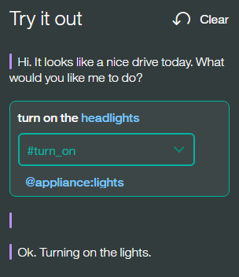

    In the dialog editor pane, the currently active node is highlighted.
1.  To check or set the value of a context variable, click the **Manage context** link.

    Any context variables that you defined in the dialog are displayed.

    In addition, a `$timezone` context variable is listed. The "Try it out" pane user interface gets user locale information from the web browser and uses it to set the `$timezone` context variable. This context variable makes it easier to deal with time references in test dialog exchanges. Consider doing something similar in your user application. If not specified, Greenwich Mean Time (GMT) is used.

    You can add a variable and set its value to see how the dialog responds in the next test dialog turn. This capability is helpful if, for example, the dialog is set up to show different responses based on a context variable value that is provided by the user.

    1.  To add a context variable, specify the variable name, and press **Enter**.
    1.  To define a default value for the context variable, find the context variable you added in the list, and then specify a value for it.

    See [Context variables](#context) for more information.

1.  Continue to interact with the dialog to see how the conversation flows through it.
    - To find and resubmit a test utterance, you can press the Up key to cycle through your recent inputs.
    - To remove prior test utterances from the chat pane and start over, click the **Clear** link. Not only are the test utterances and responses removed, but this action also clears the values of any context variables that were set as a result of your interactions with the dialog. Context variable values that you explicitly set or change are not cleared.

### What to do next

If you determine that the wrong intents or entities are being recognized, you might need to modify your intent or entity definitions.

If the right intents and entities are being recognized, but the wrong nodes are being triggered in your dialog, make sure your conditions are written correctly.

## Moving a dialog node
{: #move-node}

Each node that you create can be moved elsewhere in the dialog tree.

You might want to move a previously created node to another area of the flow to change the conversation. You can move nodes to become siblings or peers in another branch.

1.  On the node you want to move, click the **More**  icon, and then select **Move**.
1.  Select a target node that is located in the tree near where you want to move this node. Choose whether to place this node above or below the target node, or to make it a child of the target node.

## Finding a dialog node by its node ID
{: #get-node-id}

You might want to find the dialog node that is associated with a known node ID for any of the following reasons:

- You are reviewing logs, and the log refers to a section of the dialog by its node ID.
- You want to map the node IDs listed in the `nodes_visited` property of the API message output to nodes that you can see in your dialog tree.
- A dialog runtime error message informs you about a syntax error, and uses a node ID to identify the node you need to fix.

To discover a node based on its node ID, complete the following steps:

1.  From the Dialog tab of the tooling, select any node in your dialog tree.
1.  Close the edit view if it is open for the current node.
1.  In your web browser's location field, a URL should display that has the following syntax:

    ```json
    https://watson-conversation.ng.bluemix.net/space/instance-id/workspaces/workspace-id/build/dialog#node=node-id
    ```

1.  Edit the URL by replacing the current `node-id` value with the ID of the node you want to find, and then submit the new URL.
1.  If necessary, highlight the edited URL again, and resubmit it.

The tooling refreshes, and shifts focus to the dialog node with the node ID that you specified. If the node ID is for a slot, a slot handler, a node-level handler, or a conditional response, then the node in which the slot or conditional response is defined gets focus.

**Note**: If you still cannot identify the node, you can export the workspace, and use a JSON editor to find the node-id in the JSON. Look for the `type` that is associated with the node. It tells you what part of the node to look at, such as a slot, a slot's Found condition, a node-level conditional response, and so on.
