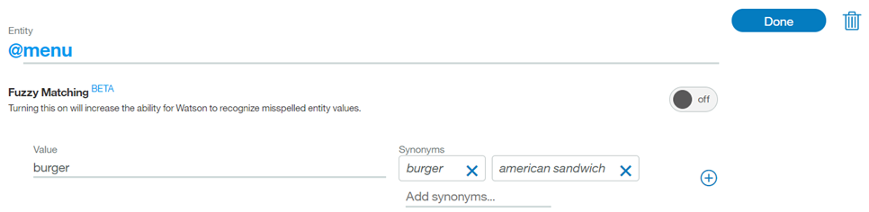
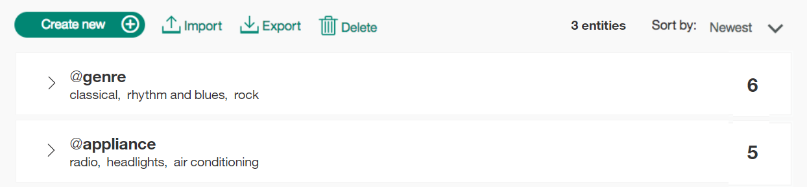
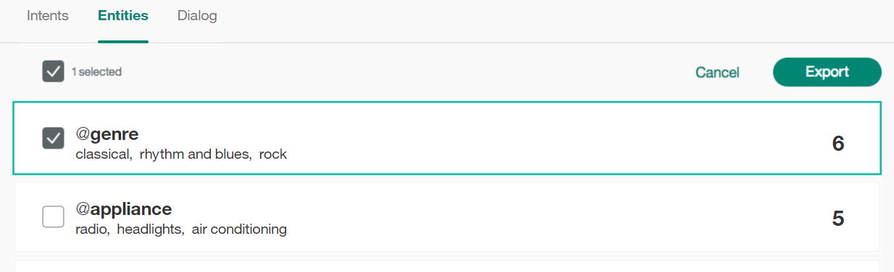
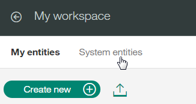
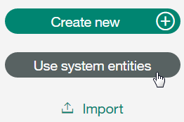

---

copyright:
  years: 2015, 2017
lastupdated: "2017-11-14"

---

{:shortdesc: .shortdesc}
{:new_window: target="_blank"}
{:tip: .tip}
{:pre: .pre}
{:codeblock: .codeblock}
{:screen: .screen}
{:javascript: .ph data-hd-programlang='javascript'}
{:java: .ph data-hd-programlang='java'}
{:python: .ph data-hd-programlang='python'}
{:swift: .ph data-hd-programlang='swift'}

# Defining entities

***Entities*** represent a class of object or a data type that is relevant to a user's purpose. By recognizing the entities that are mentioned in the user's input, the {{site.data.keyword.conversationshort}} service can choose the specific actions to take to fulfill an intent.

<iframe class="embed-responsive-item" id="youtubeplayer" type="text/html" width="640" height="390" src="https://www.youtube.com/embed/oSNF-QCbuDc?rel=0" frameborder="0" webkitallowfullscreen mozallowfullscreen allowfullscreen> </iframe>

## Entity limits
{: #entity-limits}

The number of entities, entity values, and synonyms that you can create depends on your {{site.data.keyword.conversationshort}} service plan:

| Service plan      | Entities per workspace | Entity values per workspace | Entity synonyms per workspace |
|-------------------|-----------------------:|----------------------------:|--------------------------------:|
| Standard/ Premium |                          1000 |                            100,000 |                              100,000 |
| Lite              |                            25 |                            100,000 |                              100,000 |

System entities that you enable for use count toward your plan usage totals.

## Creating entities
{: #creating-entities}

Use the {{site.data.keyword.conversationshort}} tool to create entities.

1.  In the {{site.data.keyword.conversationshort}} tool, open your workspace and then click the **Entities** tab. If **Entities** is not visible, use the  menu to open the page.
1.  Click **Create new**.

    You can also click **Use System Entities** to select from a list of common entities, provided by {{site.data.keyword.IBM_notm}}, that can be applied to any use case. See [Enabling system entities](#enable_system_entities) for more detail.
1.  In the **Add the entity name** field, type a descriptive name for the entity.

    The entity name can contain letters (in Unicode), numbers, underscores, and hyphens. For example:
    - `@location`
    - `@menu_item`
    - `@product`

    Don't include the `@` character in the entity names when you create them in the {{site.data.keyword.conversationshort}} tool. Entity names can't contain spaces or be longer than 64 characters. And entity names can't begin with the string `sys-`, which is reserved for system entities.
    {: tip}

1.  For **Fuzzy Matching**, click the button to select either on or off; fuzzy matching is off by default. This feature is available for languages noted in the [Supported languages](lang-support.html) topic.
 {: #fuzzy-matching}

    You can turn on fuzzy matching to improve the ability of the service to recognize user input terms with syntax that is similar to the entity, but without requiring an exact match. There are three components to fuzzy matching - stemming, misspelling, and partial matching:
    - *Stemming* - The feature recognizes the stem form of entity values that have several grammatical forms. For example, the stem of 'bananas' would be 'banana', while the stem of 'running' would be 'run'.
    - *Misspelling* - The feature is able to map user input to the appropriate corresponding entity despite the presence of misspellings or slight syntactical differences. For example, if you define "giraffe" as a synonym for an animal entity, and the user input contains the terms "giraffes" or "girafe", the fuzzy match is able to map the term to the animal entity correctly.
    - *Partial match* - With partial matching, the feature automatically suggests substring-based synonyms present in the user-defined entities, and assigns a lower confidence score as compared to the exact entity match.

    **Note** - For English, fuzzy matching prevents the capturing of some common, valid English words as fuzzy matches for a given entity. Currently, this feature uses only standard English dictionary words, and does not use synonyms defined by the user.
1.  In the **Value** field, type the text of a possible value for the entity. An entity value can be any string up to 64 characters in length.

    > **Important:** Don't include sensitive or personal information in entity names or values. The names and values can be exposed in URLs in an app.

    Once you have entered an entity value, you can then add any synonyms, or define specific patterns, for that entity value by selecting either `Synonyms` or `Patterns` from the *Type* drop-down menu.

    

    > **Note:** You can add *either* synonyms or patterns for a single entity value, you cannot add both.

1.  In the **Synonyms** field, type any synonyms for the entity value. A synonym can be any string up to 64 characters in length.

    
1.  The **Patterns** field lets you define specific patterns for an entity value. A pattern **must** be entered as a regular expression in the field.
  {: #pattern-entities}

    

    As in this example, for entity "ContactInfo", the patterns for phone, email, and website values can be defined as follows:
    - Phone
      - `localPhone`: `(\d{3})-(\d{4})`, e.g. 426-4968
      - `fullUSphone`: `(\d{3})-(\d{3})-(\d{4})`, e.g. 800-426-4968
      - `internationalPhone`: `^(\(?\+?[0-9]*\)?)?[0-9_\- \(\)]*$`, e.g., +44 1962 815000
    - `email`: `\b[A-Za-z0-9._%+-]+@[A-Za-z0-9.-]+\.[A-Za-z]{2,}\b`, e.g. name@ibm.com
    - `website`: `(https?:\/\/)?([\da-z\.-]+)\.([a-z\.]{2,6})([\/\w \.-]*)*\/?$`, e.g. https://www.ibm.com

    Often when using pattern entities, it will be necessary to store the text that matches the pattern in a context variable (or action variable), from within your dialog tree.

    Imagine a case where you are asking a user for their email address. The dialog node condition will contain a condition similar to `@contactInfo:email`. In order to assign the user-entered email as a context variable, the following syntax can be used to capture the pattern match within the dialog node's response section:

    ```
    {
        "context" : {
            "email": "@contactInfo.literal"
        }
    }
    ```
    {: screen}

    The pattern matching engine employed by the {{site.data.keyword.conversationshort}} service has some syntax limitations, which are necessary in order to avoid performance concerns which can occur when using other regular expression engines. Notably, entity patterns may not contain:
      - Positive repetitions (e.g., `x*+`)
      - Backreferences (e.g., `\g1`)
      - Conditional branches (e.g., `(?(cond)true))`

    The regular expression engine is loosely based on the Java regular expression engine. The {{site.data.keyword.conversationshort}} service will produce an error if you try to upload an unsupported pattern, either via the API or from within the {{site.data.keyword.conversationshort}} service Tooling UI.

1.  Click **+** and repeat the process to add more entity values.
1.  When you are finished adding entity values, click **Done**.

### Results

The entity you created is added to the **Entities** tab, and the system begins to train itself on the new data.

## Editing entities

You can click any entity in the list to open it for editing. You can rename or delete entities, and you can add, edit, or delete values, synonyms, or patterns.

## Importing entities

If you have a large number of entities, you might find it easier to import them from a comma-separated value (CSV) file than to define them one by one in the {{site.data.keyword.conversationshort}} tool.

**Note:** Importing a CSV file does not currently support patterns.

1.  Collect the entities into a CSV file, or export them from a spreadsheet to a CSV file. The required format for each line in the file is as follows:

    ```
    <entity>,<value>,<synonyms>
    ```
    {: screen}

    where &lt;entity&gt; is the name of an entity, &lt;value&gt; is a value for the entity, and &lt;synonyms&gt; is a comma-separated list of synonyms for that value.

    ```
    weekday,Monday,Mon
    weekday,Tuesday,Tue,Tues
    weekday,Wednesday,Wed
    weekday,Thursday,Thur,Thu,Thurs
    weekday,Friday,Fri
    weekday,Saturday,Sat
    weekday,Sunday,Sun
    month,January,Jan
    month,February,Feb
    month,March,Mar
    month,April,Apr
    month,May
    ```
    {: screen}

    Save the CSV file with UTF-8 encoding and no byte order mark (BOM). The maximum CSV file size is 10MB. If your CSV file is larger, consider splitting it into multiple files and importing them separately.  In the {{site.data.keyword.conversationshort}} tool, open your workspace and then click the **Entities** tab.
    {: tip}
1.  Click  and then drag a file, or browse to select a file from your computer. The file is validated and imported, and the system begins to train itself on the new data.

### Results

You can view the imported entities on the Entities tab. You might need to refresh the page to see the new entities.

## Exporting entities
{: #export_entities}

You can export a number of entities to a CSV file, so you can then import and reuse them for another Conversation application.

**Note:** Exporting a CSV file does not currently support patterns.

1.  On the Entities tab, select 

    

1.  Select the entities you want, and click the **Export** button.

    

## Deleting entities
{: #delete_entities}

You can select a number of entities for deletion.

**IMPORTANT**: By deleting entities you are also deleting all associated values, synonyms, or patterns, and these items cannot be retrieved later. All dialog nodes that reference these entities or values must be updated manually to no longer reference the deleted content.

1.  On the Entities tab, select 

    

1.  Select the entities you want to delete, and click the **Delete** button. **Note**: The delete feature supports bulk delete of entities.

## Enabling system entities
{: #enable_system_entities}

The {{site.data.keyword.conversationshort}} service provides a number of *system entities*, which are common entities that you can use for any application. Enabling a system entity makes it possible to quickly populate your workspace with training data that is common to many use cases.

System entities can be used to recognize a broad range of values for the object types they represent. For example, the `@sys-number` system entity matches any numerical value, including whole numbers, decimal fractions, or even numbers written out as words.

System entities are centrally maintained, so any updates are available automatically. You cannot modify system entities.

1.  On the Entities tab, click **System entities**.

    

    If you haven't created any entities, click **Use system entities**.

    

1.  Browse through the list of system entities to choose the ones that are useful for your application.
    - To see more information about a system entity, including examples of matching input, click the entity in the list.
    - For details about the available system entities, see [System entities](system-entities.html).
1.  Click the toggle switch next to a system entity to enable or disable it. You can also enable or disable all system entities by clicking the **All toggle** switch at the top of the list.

### Results

After you enable system entities, the {{site.data.keyword.conversationshort}} service begins retraining. After training is complete, you can use the entities.
