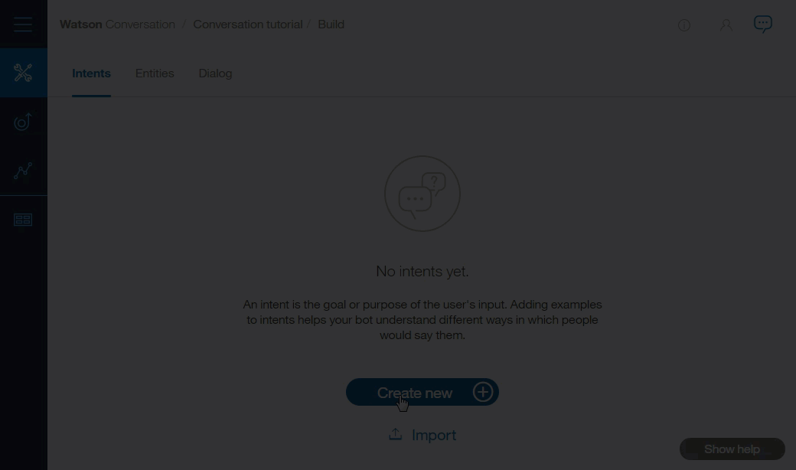
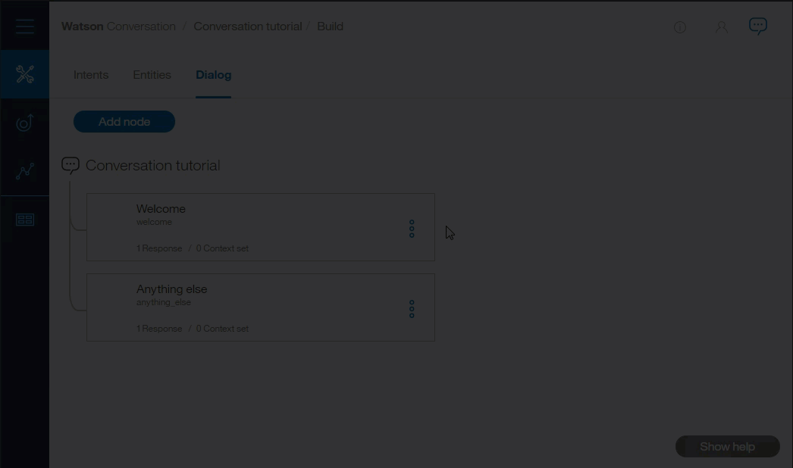

---

copyright:
  years: 2015, 2017
lastupdated: "2017-07-31"

---

{:shortdesc: .shortdesc}
{:new_window: target="_blank"}
{:tip: .tip}
{:pre: .pre}
{:codeblock: .codeblock}
{:screen: .screen}
{:javascript: .ph data-hd-programlang='javascript'}
{:java: .ph data-hd-programlang='java'}
{:python: .ph data-hd-programlang='python'}
{:swift: .ph data-hd-programlang='swift'}

# Getting started tutorial
{: #gettingstarted}

In this short tutorial, we introduce the {{site.data.keyword.conversationshort}} tool and go through the process of creating your first conversation.
{: shortdesc}

## Before you begin
{: #prerequisites}

If you already created a service instance, you're all set with these prerequisites. Move on to Step 1.
{: tip}

1.  Go to the [{{site.data.keyword.conversationshort}} service ](https://console.{DomainName}/catalog/services/conversation/){: new_window} and either sign up for a free {{site.data.keyword.Bluemix_notm}} account or log in.
1.  After you log in, type `conversation-tutorial` in the **Service name** field of the {{site.data.keyword.conversationshort}} page and click **Create**.

## Step 1: Launch the tool
{: #launch-tool}

After you create the service instance, you'll land on the dashboard for the instance. Launch the  {{site.data.keyword.conversationshort}} tool from here.

Click **Manage**, then **Launch tool**.

You might be prompted to log in to the tool separately. If so, provide your IBM Bluemix credentials to log in.

## Step 2: Create a workspace
{: #create-workspace}

Your first step in the {{site.data.keyword.conversationshort}} tool is to create a workspace.

A [*workspace*](configure-workspace.html) is a container for the artifacts that define the conversation flow.

1.  In the {{site.data.keyword.conversationshort}} tool, click **Create**.
1.  Give your workspace the name `Conversation tutorial` and click **Create**. Youʼll land on the **Intents** tab of your new workspace.

[

## Step 3: Create intents
{: #create-intents}

An [intent](intents.html) represents the purpose of a user's input. You can think of intents as the actions your users might want to perform with your application.

For this example, we're going to keep things simple and define only two intents: one for saying hello, and one for saying goodbye.

1.  Make sure you're on the Intents tab. (You should already be there, if you just created the workspace.)
1.  Click **Create new**.
1.  Name the intent `hello`.
1.  Type `hello` as a **User example** and press Enter.

   *Examples* tell the {{site.data.keyword.conversationshort}} service what kinds of user input you want to match to the intent. The more examples you provide, the more accurate the service can be at recognizing user intents.
1.  Add four more examples and click **Done** to finish creating the #hello intent:
    - `good morning`
    - `greetings`
    - `hi`
    - `howdy`

   [

1.  Create another intent named #goodbye with these five examples:
    - `bye`
    - `farewell`
    - `goodbye`
    - `I'm done`
    - `see you later`

### Result

You've created two intents, #hello and #goodbye, and provided example user input to train {{site.data.keyword.watson}} to recognize these intents in your users' input.

## Step 4: Build a dialog
{: #build-dialog}

A [dialog](dialog-build.html) defines the flow of your conversation in the form of a logic tree. Each node of the tree has a condition that triggers it, based on user input.

We'll create a simple dialog that handles our #hello and #goodbye intents, each with a single node.

### Adding a start node

1.  In the {{site.data.keyword.conversationshort}} tool, click the **Dialog** tab.
1.  Click **Create**. You'll see two nodes:
    - **Welcome**: Contains a greeting that is displayed to your users when they first engage with the bot.
    - **Anything else**: Contains phrases that are used to reply to users when their input is not recognized.

    
1.  Click the **Welcome** node to open it in the edit view.
1.  Replace the default response with the text, `Welcome to the Conversation tutorial!`.

    
1.  Click  to close the edit view.

### Result

You created a dialog node that is triggered by the `welcome` condition, which is a special condition that indicates that the user has started a new conversation. Your node specifies that when a new conversation starts, the system should respond with the welcome message.

### Testing the start node

You can test your dialog at any time to verify the dialog. Let's test it now.

- Click the  icon to open the "Try it out" pane. You should see your welcome message.

    

### Adding nodes to handle intents

Now let's add nodes to handle our intents between the `Welcome` node and the `Anything else` node.

1.  Click the More icon  on the **Welcome** node, and then select **Add node below**.
1.  Type `#hello` in the **Enter a condition** field of this node. Then select the **#hello** option.
1.  Add the response, `Good day to you.`
1.  Click  to close the edit view.

   [
1.  Click the More icon  on this node, and then select **Add node below** to create a peer node. In the peer node, specify `#goodbye` as the condition, and `OK. See you later!` as the response.

    

### Testing intent recognition

You  built a simple dialog to recognize and respond to both hello and goodbye inputs. Let's see how well it works.

1.  Click the  icon to open the "Try it out" pane. There's that reassuring welcome message.
1.  At the bottom of the pane, type `Hello` and press Enter. The output indicates that the #hello intent was recognized, and the appropriate response (`Good day to you.`) appears.
1.  Try the following input:
    - `bye`
    - `howdy`
    - `see ya`
    - `good morning`
    - `sayonara`

   [

{{site.data.keyword.watson}} can recognize your intents even when your input doesn't exactly match the examples you included. The dialog uses intents to identify the purpose of the user's input regardless of the precise wording used, and then responds in the way you specify.

### Result

That's it. You created a simple conversation with two intents and a dialog to recognize them.

## Step 5: Review the sample workspace
{: #review-sample-workspace}

Open the sample workspace to see intents similar to the ones you just created plus many more, and see how they are used in a complex dialog.

1.  Go back to the Workspaces page.
   You can click the  button from the navigation menu.
1.  On the **Car Dashboard - Sample** workspace tile, click the **Edit sample** button.

    

## What to do next
{: #next-steps}

This tutorial is built around a simple example. For a real application, you'll need to define some more interesting intents, some entities, and a more complex dialog.

- Try the advanced [tutorial](tutorial.html) to add entities and clarify a user's purpose.
- [Deploy](deploy.html) your workspace by connecting it to a front-end user interface, social media, or a messaging channel.
- Check out the [sample apps](sample-applications.html).
