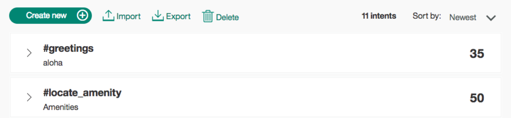
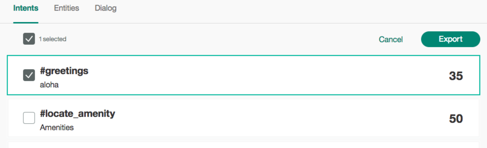
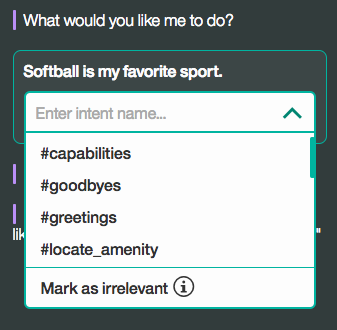

---

copyright:
  years: 2015, 2017
lastupdated: "2017-06-09"

---

{:shortdesc: .shortdesc}
{:new_window: target="_blank"}
{:tip: .tip}
{:pre: .pre}
{:codeblock: .codeblock}
{:screen: .screen}
{:javascript: .ph data-hd-programlang='javascript'}
{:java: .ph data-hd-programlang='java'}
{:python: .ph data-hd-programlang='python'}
{:swift: .ph data-hd-programlang='swift'}

# Defining intents

An *intent* is a purpose or goal expressed in a customer's input, such as answering a question or processing a bill payment. By recognizing the intent expressed in a customer's input,  {{site.data.keyword.conversationshort}} can choose the correct dialog flow for responding to it.
{:shortdesc}

@[youtube](DmvN6ZJrZE4?rel=0)

## Planning your intents

To plan the intents for your application, you need to consider what your customers might want to do, and what you want your application to be able to handle. Choosing the correct intent for a user's input is the first step in providing a useful response. The intents you identify for your application will determine the dialog flows you need to create; they also might determine which back-end systems your application needs to integrate with in order to complete customer requests (such as customer databases or payment-processing systems).

1.  Gather as many **actual customer questions, commands, or other inputs** as possible. Using input from real users gives a better picture of the expected input than having experts create lists of possible utterances. Remember that customers might phrase the same kind of request in many different ways. For example, the following examples all represent requests for weather information:

    - `Tell me the current weather conditions.`
    - `Is it raining?`
    - `What's it like outside?`

1.  After you have a list of examples, **sort them into categories** based on the capabilities you want your application to support. These categories represent the intents you will define, and the examples will help your application to identify the intents in new input. As you plan your intents, keep the following guidelines in mind:

    - Do not make your intents too similar. Similar intents can be difficult for the {{site.data.keyword.conversationshort}} service to distinguish. If you find that you have several intents that are close in meaning, consider whether you could combine them into a single intent, and then use entities to provide multiple possible responses for that intent.
    - Remember that a customer's input does not have to be an exact match for any of your examples; intents are recognized using natural-language processing.

1.  **Continue to refine** your intents and examples as needed. Do not think of your set of intents as a finished product. It is likely that when you design your dialogs, you will identify additional intents that you need to add. You can also continue to gather input from new customers and use it to add new examples; this iterative process improves your application's ability to recognize intents accurately.

## Intent limits

The number of intents and examples you can create in a single service instance depends on your {{site.data.keyword.conversationshort}} service plan:

| Service plan     | Intents per service instance | Examples per service instance |
|------------------|-----------------------------:|------------------------------:|
| Standard/Premium |                        2,000 |                        25,000 |
| Lite             |                           25 |                        25,000 |

## Creating an intent

You use the Conversation tool to create intents.

1.  In the Conversation tool, open your workspace and then select the **Intents** tab in the navigation bar. If **Intents** is not visible, use the  menu to open the page.
1.  Select **Create new**.
1.  In the Intent name field, type a descriptive name for the intent.
    - The intent name can contain letters (in Unicode), numbers, underscores, hyphens, and periods.
    - The name cannot consist of `..` or any other string of only periods.
    - Intent names cannot contain spaces and must not exceed 128 characters. The following are examples of intent names:
        - `#weather_conditions`
        - `#pay_bill`
        - `#escalate_to_agent`

    > **Tip**: The tooling automatically includes the `#` character in the intent names, so you do not have to add one.

    You can select **Create** to save your intent name without adding examples. You can also select the user example field, or use the tab key to move forward, and add examples.

1.  In the **User example** field, type the text of a user example for the intent. An example can be any string up to 1024 characters in length. The following might be examples for the `#pay_bill` intent:
    - `I need to pay my bill.`
    - `Pay my account balance`
    - `make a payment`

    If you have defined or plan to define entities that correspond to this intent, refer to the entities or their associated synonyms in some of the examples. Doing so helps to establish a relationship between the intent and entities.

    > **Important**: Intent names and example text can be exposed in URLs when an application interacts with the service. Do not include sensitive or personal information in these artifacts.

    Press Enter or select **+** to save the example.
1.  Repeat the same process to add more examples. You can tab between each example. Provide at least 5 examples for each intent. The more examples you provide, the more accurate your application can be.

    
1.  When you have finished adding examples, select **Create** to finish creating the intent.

### Results

The intent you created is added to the Intents tab, and the system begins to train itself on the new data.

You can select any intent in the list to open it for editing. You can make the following changes:

    - Rename the intent.
    - Delete the intent.
    - Add, edit, or delete examples.
    - Move an example to a different intent.

You can tab from the intent name to each example, editing the examples if you choose.

To move an example, select the example by selecting the check box and then select **Move to**.

  

## Importing intents and examples

If you have a large number of intents and examples, you might find it easier to import them from a comma-separated value (CSV) file than to define them one by one in the Conversation tool.

1.  Collect the intents and examples into a CSV file, or export them from a spreadsheet to a CSV file. The required format for each line in the file is as follows:

    ```
    <example>,<intent>
    ```
    {:screen}

    where `<example>` is the text of a user example, and `<intent>` is the name of the intent you want the example to match. For example:

    ```
    Tell me the current weather conditions.,weather_conditions
    Is it raining?,weather_conditions
    What's the temperature?,weather_conditions
    Where is your nearest location?,find_location
    Do you have a store in Raleigh?,find_location
    ```
    {:screen}

    > **Important**: Save the CSV file with UTF-8 encoding and no byte order mark (BOM).

1.  In the Conversation tool, open your workspace and then select the **Intents** tab in the navigation bar. If **Intents** is not visible, use the  menu to open the page.

1.  Select  and then drag a file, or browse to select a file from your computer. The file is validated and imported, and the system begins to train itself on the new data.

    > **Important**: The maximum CSV file size is 10MB. If your CSV file is larger, consider splitting it into multiple files and importing them separately.

### Results

You can view the imported intents and the corresponding examples on the Intents tab. You might need to refresh the page in order to see the new intents and examples.

## Exporting intents
{:#export_intents}

You can export a number of intents to a CSV file, so you can then import and reuse them for another Conversation application.

1. On the Intents tab, select 

    

2. Select the intents you want, and click the **Export** button.
    

## Deleting intents
{:#delete_intents}

You can select a number of intents for deletion.

**IMPORTANT**: By deleting intents you are also deleting all associated examples or values, and synonyms, and these items can not be retrieved later. All dialog nodes that reference these intents or values must be updated manually to no longer reference the deleted content.

1. On the Intents tab, select 

    

2. Select the entities you want to delete, and click the **Delete** button. **Note**: The delete feature supports bulk delete of intents.

## Testing your intents

After you have finished creating new intents, you can test the system to see if it recognizes your intents as you expect.

1.  In the Conversation tool, select the  icon.

1.  In the Try it out panel, enter a question or other text string and press Enter to see which intent is recognized. If the wrong intent is recognized, you can improve your model by adding this text as an example to the correct intent.

    **Tip**: If you have recently made changes in your workspace, you might see a message indicating that the system is still retraining. If you see this message, wait until training completes before testing:

    

    The response indicates which intent was recognized from your input.

    

1.  If the system did not recognize the correct intent, you can correct it. To correct the recognized intent, select the displayed intent and then select the correct intent from the list. After your correction is submitted, the system automatically retrains itself to incorporate the new data.

    

1.  If the input is unrelated to your application, you can indicate that. Select the displayed intent and choose "Mark as irrelevant". [Learn more](irrelevant_utterance.html) about Irrelevant input.

    

If your intents are not being correctly recognized, consider making the following kinds of changes:

- Add the unrecognized text as an example to the correct intent.
- Move existing examples from one intent to another.
- Consider whether your intents are too similar, and redefine them as appropriate.

## Absolute scoring and Mark as irrelevant

As of February 2017, there is a new algorithm for scoring intent confidence and returning intents. You can also mark inputs as "irrelevant". These changes require an [upgrade to your workspace](upgrading.html).

### Absolute scoring

We now score each intent’s confidence on its own, not in relation to other intents. This allows the flexibility to have multiple intents returned. It also means the system may not return an intent at all. If the system has low confidence (less than .2) that any intents relate to the user’s input, the system will not return an intent.

As intent confidence scores change, your dialogs may need restructuring. For example, if you conditioned your dialog with an intent that now has low confidence, the system’s response will no longer be correct.

### Mark as irrelevant

**Note** Refer to [Supported languages](lang-support.html) for this feature.

After upgrading your workspace, you can [test input in the Try it out panel](intents.html#testing-your-intents) to see the changes. You can  "Mark as irrelevant" to indicate that the input is not related to your application.

Inputs marked as irrelevant are stored in the workspace and are included as part of the training data. **They cannot be accessed or changed later in the tooling.**

**The only way to remove the "Irrelevant" tag would be to use the same input in the Try it out panel and then change the intent. Be positive you want to make this change.**

**Note** If you already have an intent for inputs that are out of scope or off topic, such as #off_topic, you should delete that intent and test your workspace with the use of "Irrelevant".
