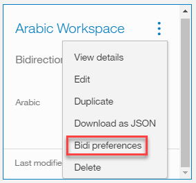
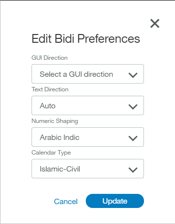

---

copyright:
  years: 2015, 2017
lastupdated: "2017-07-12"

---

{:shortdesc: .shortdesc}
{:new_window: target="_blank"}
{:tip: .tip}
{:pre: .pre}
{:codeblock: .codeblock}
{:screen: .screen}
{:javascript: .ph data-hd-programlang='javascript'}
{:java: .ph data-hd-programlang='java'}
{:python: .ph data-hd-programlang='python'}
{:swift: .ph data-hd-programlang='swift'}

# Supported languages
The {{site.data.keyword.conversationshort}} service supports the languages listed. Individual features of the service are supported to a greater or lesser extent for each language.
{: shortdesc}

In the following table, the level of language and feature support is indicated by these codes:

- **GA** - The feature is generally available and supported for this language. Note that features may continue to be updated even after they are generally available.
- **Ex** - Language support is only Experimental.
- **Beta** - The feature is supported only as a Beta release, and is still undergoing testing before it is made generally available in this language.
- **Blank** - Absence of any code indicates that a feature is not available in this language.

|                  | **[Defining intents](intents.html)**, **[entities](entities.html)**, and **[dialog](dialog-build.html)** | **[Absolute scoring and 'Mark as irrelevant'](intents.html#mark-irrelevant)** | **System entities ([number](system-entities.html#sys-number), [currency](system-entities.html#sys-currency), [percentage](system-entities.html#sys-percentage), [date, time](system-entities.html#sys-datetime))** | **[Entity fuzzy matching](entities.html#fuzzy-matching)** |
|:---|:---:|:---:|:---:|:---:|
| **English (en)**                   | GA | GA | GA   Beta ([location](system-entities.html#sys-location), [person](system-entities.html#sys-person)) | Beta (Stemming, misspelling) |
| **Arabic (ar)**                    | GA | Beta | Beta |  |
| **Chinese (Simplified) (zh-cn)**   | Ex | Beta |  |  |
| **Chinese (Traditional) (zh-tw)**  | Ex | Beta |  |  |
| **Czech (cs)**                     | Ex | Beta | Beta | Beta (Misspelling only) |
| **Dutch (nl)**                     | Ex | Beta |  |  |
| **French (fr)**                    | GA | GA | GA | Beta (Misspelling only) |
| **German (de)**                    | GA | GA | GA | Beta (Misspelling only) |
| **Italian (it)**                   | GA | GA | GA | Beta (Misspelling only) |
| **Japanese (ja)**                  | GA | GA | GA |  |
| **Korean (ko)**                    | GA | GA | Beta |  |
| **Portuguese (Brazilian) (pt-br)** | GA | GA | GA | Beta (Misspelling only) |
| **Spanish (es)**                   | GA | GA | GA | Beta (Misspelling only) ||

**Note:** The {{site.data.keyword.conversationshort}} service supports multiple languages as noted, but the tooling interface itself (descriptions, labels, etc.) is in English. All supported languages can be input and trained through the English interface.

## Changing a workspace language

Once a workspace has been created, its language cannot be modified. If it is necessary to change the supported language of a workspace, the user should download the workspace. Then, edit the resulting JSON file in a text editor, searching for a JSON property called `language`.

The `language` property should be set to the original language of the workspace; for example, English would be `en`. Modify the value of this property, changing it to the desired language (`fr` for French, `de` for German, etc.). Save the changes to the JSON file, and import the modified file into your {{site.data.keyword.conversationshort}} service instance.

## Configuring bi-directional languages
{: #configuring-bi-directional}

For bi-directional languages, for example Arabic, you can change your workspace preferences accordingly. From your workspace tab, select the *Actions* drop-down menu, and select **Bidi preferences** (this option is only available for workspaces set to a bi-directional language):

Select from the following options for your workspace:

- **Text Direction**: Allows you to select the direction of typed text. Choose `LTR` (left-to-right) or `RTL` (right-to-left), or select `Auto` which will automatically choose the text direction based on your system settings. The `None` option will display left-to-right text.
- **Numeric Shaping**: Allows you to specify which form of numerals to use when presenting regular digits. Choose from `Nominal`, `Arabic-Indic`, or `Arabic-European`. The `None` option will display Western numerals.
- **Calendar Type**: Allows you to specify how you choose filtering dates in the workspace UI. Choose `Islamic-Civil`, `Islamic-Tabular`, `Islamic-Umm al-Qura`, or `Gregorian`. **Note**: This setting does not apply to the "Try it out" panel.

When finished making selections, click **Update** to save and return to the workspace tab.
