---

copyright:
  years: 2015, 2017
lastupdated: "2017-07-07"

---

{:shortdesc: .shortdesc}
{:new_window: target="_blank"}
{:tip: .tip}
{:pre: .pre}
{:codeblock: .codeblock}
{:screen: .screen}
{:javascript: .ph data-hd-programlang='javascript'}
{:java: .ph data-hd-programlang='java'}
{:python: .ph data-hd-programlang='python'}
{:swift: .ph data-hd-programlang='swift'}

# Working with conversations
{: #logs_convo}

To open a list of chat messages, select **User conversations** in the navigation bar. If **User conversations** is not visible, use the  menu to open the page.
{: shortdesc}

When you open the **User conversations** page, the default view lists results for the last 90 days, with the newest results first. The top intent (#intent) and any recognized entity (@entity) values used in the message, and the message text are available. For intents that are not recognized, or if an entity is not recognized or has not been provided, the value shown is *Irrelevant*.
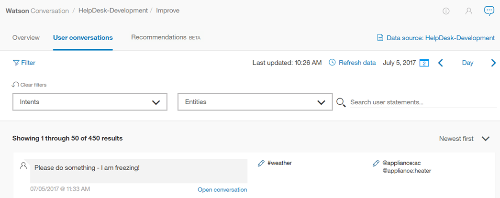

## Log limits
{: #log-limits}

The length of time for which chat messages are retained depends on your {{site.data.keyword.conversationshort}} service plan:

  Service plan                         | Chat log retention
  ------------------------------------ | ------------------------------------
  Standard/Premium                     | Last 30 days
  Free                                 | Last 7 days

## Filtering chat messages
You can filter chat messages by *Search user statements*, *Intents*, *Entities*, and *Last* n *days*:

*Search user statements* - Type a word in the search bar. This searches the user's input, but not your bot's reply.

*Intents* - Select the drop-down menu and type an intent in the input field, or choose from the populated list. You can select more than one intent, which filters the results using any of the    selected intents.

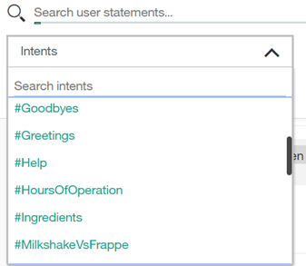

*Entities* - Select the drop-down menu and type an entity name in the input field, or choose from the populated list. You can select more than one entity, which filters the results by any of the selected entities. If you filter by intent *and* entity, your results will include the messages that have both values. You can also filter for results with no entities.

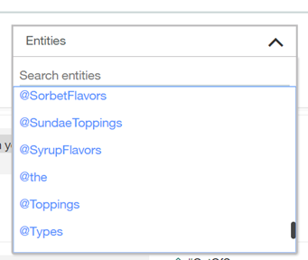

*Last* n *days* - Select the drop-down menu to select a number of days to search. Choose `Custom` to define a specific time period to search.

Chat messages may take some time to update. Allow at least 30 minutes after a user's input before filtering for that content.

## Viewing an individual conversation
You can expand each message to see what the user said in the whole conversation, and how your bot answered. To do this, select **Open conversation**. You are automatically taken to the message you selected within that conversation.

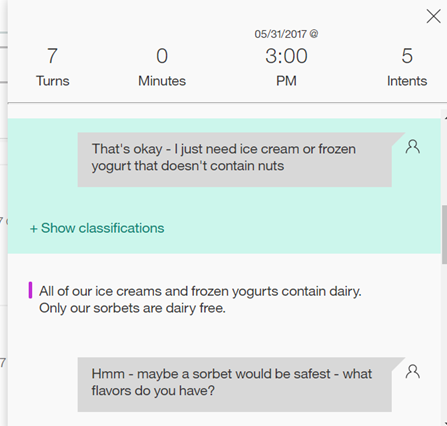

You can then choose to show the classification(s) for the message you selected.

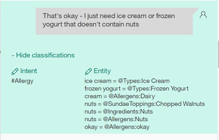

## Correcting an intent

1.  To correct an intent, select the  edit icon beside the chosen #intent.
1.  From the list provided, select the correct intent for this input.
    - Begin typing in the entry field and the list of intents is filtered.
    - You can also choose **Mark as irrelevant** from this menu. (For more information, see "[Mark as irrelevant](irrelevant_utterance.html)".) Or, you can choose **Do not train on intent**, which does not save this utterance as an example for training.

    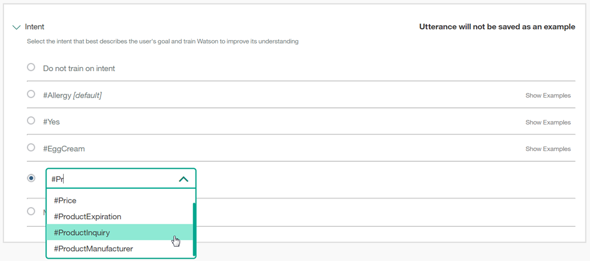
1.  Select **Save**.

    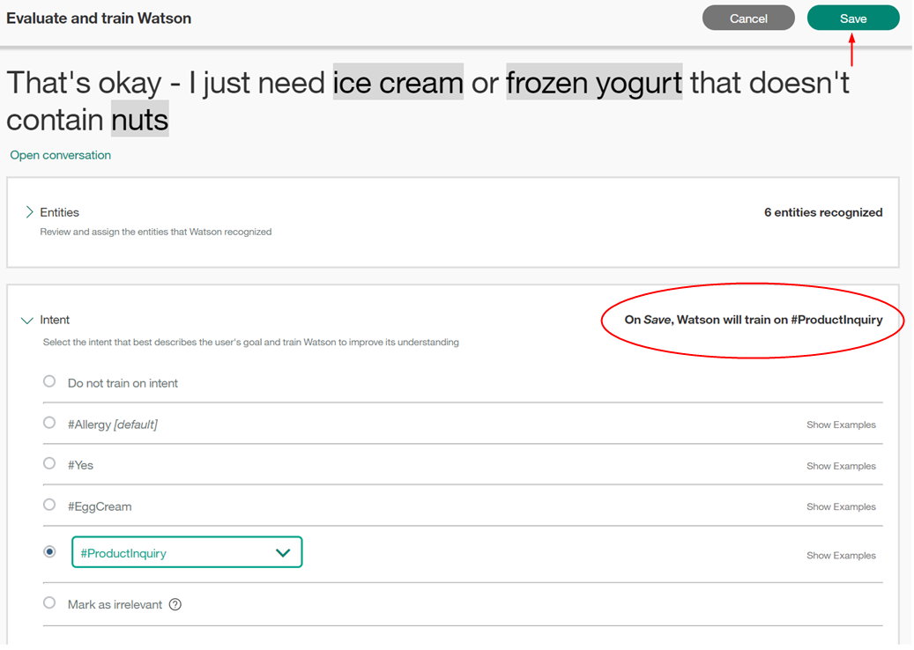

## Adding an entity value or synonym

1.  To add an entity value or synonym, select the  edit icon beside the chosen @entity.
1.  Select **Add entity**.

    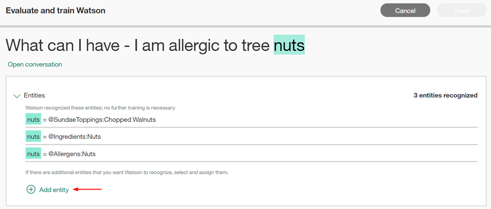
1.  Now, select a word or phrase in the underlined user input.

    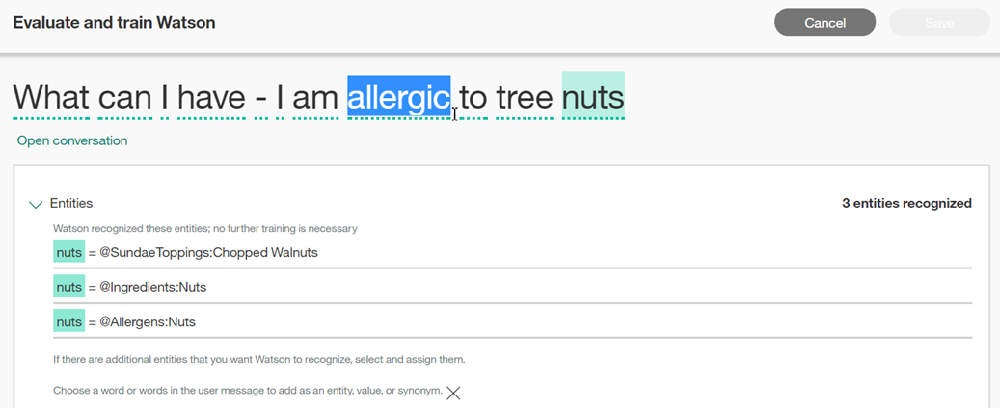
1.  Choose an entity to which the highlighted phrase will be added as a value.
    - Begin typing in the entry field and the list of entities and values is filtered.
    - To add the highlighted phrase as a synonym for an existing value, choose the "@entity:value" from the drop-down list.

    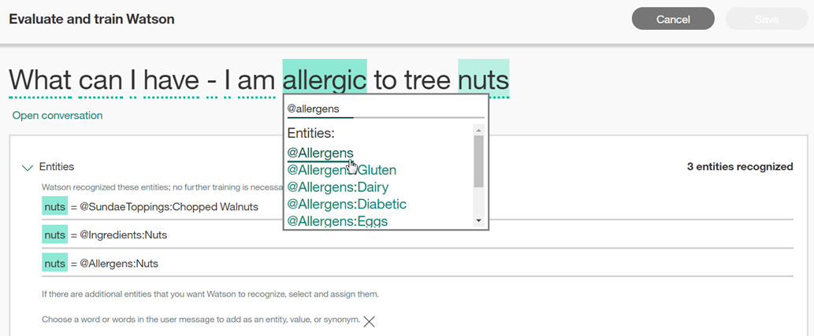
1.  Select **Save**.

    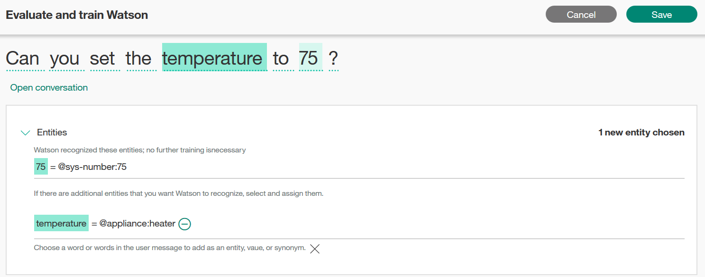
