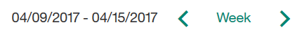
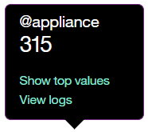

---

copyright:
  years: 2015, 2017
lastupdated: "2017-11-28"

---

{:shortdesc: .shortdesc}
{:new_window: target="_blank"}
{:tip: .tip}
{:pre: .pre}
{:codeblock: .codeblock}
{:screen: .screen}
{:javascript: .ph data-hd-programlang='javascript'}
{:java: .ph data-hd-programlang='java'}
{:python: .ph data-hd-programlang='python'}
{:swift: .ph data-hd-programlang='swift'}

# The Overview page

The Overview page of the **Improve** panel provides a summary of conversations between users and your workspace. You can view the amount of traffic for a given time period, as well as the intents and entities that were recognized most often in user conversations.
{: shortdesc}

The statistics that are displayed on the Overview page cover a longer period of time than the period for which logs of user conversations are retained. These statistics represent external traffic - users or API calls - that has interacted with your workspace; they do not include interactions from the *Try it out* panel in the tool.

You can use the Overview page to answer questions like:

* Which months had the largest and smallest numbers of conversations last year?
* What was the average number of conversations per week during the first quarter?
* Which intents appeared most often last week?
* Which entity values were recognized the most times during September?

To open the Overview page, select **Overview** in the navigation bar. If **Overview** is not visible, use the  menu to open the page.

  

The top part of the page includes the following controls:

* *Refresh data* - Allows you to refresh the Overview page statistics immediately. The Overview page shows when the data that it displays was last updated. You can select **Refresh data** if you think that newer data might be available.
* Time period control - Use this control to choose the period for which data is displayed.  This control affects all data shown on the page: not just the number of conversations displayed in the graph, but also the statistics displayed along with the graph, and the lists of top intents and entities.

  

You can choose whether to view data for a single day, a week, a month, a quarter, or a year.  In each case, the data points on the graph adjust to an appropriate measurement period.  For example, when viewing a graph for a day, the data is presented in hourly values, but when viewing a graph for a week, the data is shown by day.  A week always runs from Sunday through Saturday.  You cannot create custom time periods, such as a week that runs from Thursday to the following Wednesday, or a month that begins on any date other than the first.

## All conversations

A graph displays the total number of conversations for the date range selected.

**Note:** A 'conversation' is considered to be any interaction with the workspace, so if there are conversations where the service starts by saying "Hi, how can I help you?", and then the user closes their browser without responding, that conversation is included in the total conversation count.

You can select **View logs** to open the [User conversations](logs_convo.html) page, with the date range filtered to match the time period that you have selected for the Overview page. Depending on your plan and the date range that you selected, you might see no data. For example, the {{site.data.keyword.conversationshort}} [Standard service plan](logs_convo.html#log-limits) only retains chat logs for 30 days; if you choose a date range older than 30 days, you will see no data.

**Note:** The [User conversations](logs_convo.html) page displays the total number of *utterances*. An utterance is a single message the user sends to the workspace. Each conversation may be made up of multiple utterances. Thus, the number of results on the [User conversations](logs_convo.html) page is different than the number of conversations shown on this Overview page.

While viewing the graph, you can click on an individual data point to see the numeric value, as shown here:

Below the graph, statistics related to the displayed data are shown:

* *Total conversations* - The total number of conversations that took place during this time period
* *Max. conversations* - The maximum number of conversations for a single data point within the time period
* *Weak understanding* - The number of conversations with weak understanding. These conversations are not classified by an intent, and do not contain any known entities. These can be useful in identifying potential dialog problems.

## Top intents and Top entities

You can also view the intents and entities that were recognized most often during the specified time period. By default you see the top three of each, but you can change that to a larger number, like 5 or 10.

* *Top intents* - Intents are shown in a simple list.  In addition to seeing the number of times an intent was recognized, you can use the **View logs** link to open the User conversations page with the date range filtered to match the data you are viewing, and the intent filtered to match the selected intent.

* *Top entities* are shown in a bar chart. For each entity you can select the bar to see the number that the bar represents.

  

  Select **Show top values** to see a list of the most common values that were identified for this entity during the time period. Select **View logs** to open the [User conversations](logs_convo.html) page with the date range filtered to match the data you are viewing, and the entity filtered to match the selected entity.
