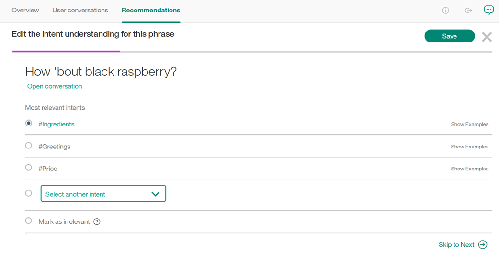

---

copyright:
  years: 2015, 2017
lastupdated: "2017-07-07"

---

{:shortdesc: .shortdesc}
{:new_window: target="_blank"}
{:tip: .tip}
{:pre: .pre}
{:codeblock: .codeblock}
{:screen: .screen}
{:javascript: .ph data-hd-programlang='javascript'}
{:java: .ph data-hd-programlang='java'}
{:python: .ph data-hd-programlang='python'}
{:swift: .ph data-hd-programlang='swift'}

# Recommendations
This page recommends ways to improve your system.
{: shortdesc}

This feature is available only to Premium users.
{: tip}

By analyzing the conversations that users have with your chatbot, and taking into account your system's current training data and response certainty, you can take recommended actions to easily and efficiently improve your chatbot.

Recommendations are generated nightly, and require a large volume of user messages.
{: tip}

## Improve existing intents
Currently, the only recommendation made by the system is to **Improve existing intents**.

This recommendation takes individual phrases, entered by users, that the system does not recognize, and then allows you to select an intent for each phrase. This lets the system better understand what your users are saying.

Click **Start** to begin categorizing phrases.

When you enter or exit **Improve existing intents**, the progress bar shows how many suggestions you have acted on in the current session, out of the total suggestions left for the day. Note that if you exit and reenter, the progress bar will start from "empty" again, but that does not mean your previous suggestions were lost - they just don’t count towards the progress of the current session.

Select the best intent for understanding a phrase from the list provided, or select *Mark as irrelevant*. Messages are added to intents as examples (added as training data) as soon as you click **Save**.

The *Skip to Next* button allows you to skip the current suggested phrase, and move to the next one. The skipped suggestion will not be shown again if you exit and reenter **Improve existing intents** during the same day, but it may display again in suggestions for subsequent days.

