---

copyright:
  years: 2015, 2017
lastupdated: "2017-10-19"

---

{:shortdesc: .shortdesc}
{:new_window: target="_blank"}
{:tip: .tip}
{:pre: .pre}
{:codeblock: .codeblock}
{:screen: .screen}
{:javascript: .ph data-hd-programlang='javascript'}
{:java: .ph data-hd-programlang='java'}
{:python: .ph data-hd-programlang='python'}
{:swift: .ph data-hd-programlang='swift'}

# Creazione di un dialogo
{: #dialog-build}

Il dialogo utilizza gli intenti e le entità che vengono identificati nell'input dell'utente, oltre al contesto ottenuto dall'applicazione, per interagire con l'utente e infine fornire una risposta utile.
{: shortdesc}

La risposta potrebbe essere quella fornita per una domanda del tipo `Dove posso fare benzina?` o l'esecuzione di un comando, come ad esempio l'accensione della radio. L'intento e l'entità potrebbero essere informazioni sufficienti per identificare la risposta corretta o il dialogo potrebbe chiedere all'utente un ulteriore input necessario per rispondere correttamente. Ad esempio, se un utente chiede, "Dove posso prendere qualcosa da mangiare?" potresti voler chiarire se vuole un ristorante o un supermercato, in loco o da asporto e così via. Puoi chiedere ulteriori dettagli in una riposta di testo e creare uno o più nodi figlio per elaborare il nuovo input.

<iframe class="embed-responsive-item" id="youtubeplayer" type="text/html" width="640" height="390" src="https://www.youtube.com/embed/oQUpejt6d84?rel=0" frameborder="0" webkitallowfullscreen mozallowfullscreen allowfullscreen> </iframe>

## Panoramica del dialogo
{: #overview}

Il dialogo viene rappresentato graficamente nello strumento come una struttura ad albero. Crea un ramo per elaborare ogni intento che desideri venga gestito dalla conversazione. Un ramo è composto da più nodi.

### Nodi del dialogo

Ogni nodo di dialogo contiene, come minimo, una condizione e una risposta.

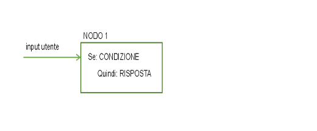

- Condizione: specifica le informazioni che devono essere presenti nell'input utente affinché questo nodo nel dialogo venga attivato. Le informazioni potrebbero essere un intento specifico, un valore di entità o un valore di variabile di contesto. Per ulteriori informazioni, vedi [Condizioni](#conditions).
- Risposta: l'espressione utilizzata dal servizio per rispondere all'utente. La risposta può anche essere configurata per attivare azioni programmatiche. Per ulteriori informazioni, vedi [Risposte](#responses).

Il nodo può essere considerato come avente una costruzione if/then: se la condizione è true, allora restituirà questa risposta.

Ad esempio, il seguente nodo viene attivato se la funzione di elaborazione del linguaggio naturale del servizio determina che l'input utente contiene l'intento `#cupcake-menu`. Come risultato del nodo che viene attivato, il servizio risponde con una risposta appropriata.

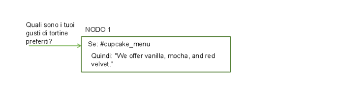

Un singolo nodo con una sola condizione e risposta può gestire semplici richieste dell'utente. Ma, il più delle volte, gli utenti hanno domande più sofisticate o desiderano aiuto con attività più complesse. Puoi aggiungere dei nodi figlio che richiedano all'utente di fornire qualsiasi ulteriore informazione richiesta dal servizio. 

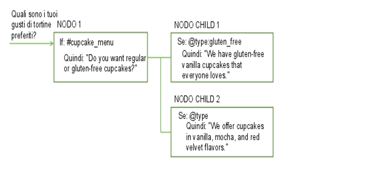

### Flusso del dialogo

Il dialogo che crei viene elaborato dal servizio dall'alto verso il basso.

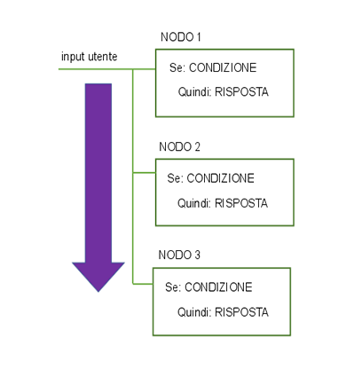

Mentre scende lungo la struttura ad albero, se il servizio trova una condizione che viene soddisfatta, attiverà tale nodo. Si sposta quindi da sinistra a destra sul nodo attivato per controllare l'input utente e verificare la presenza di eventuali condizioni del nodo figlio. Mentre controlla i nodi figlio, si sposta di nuovo dall'alto verso il basso.

Il servizio continua il suo percorso attraverso la struttura ad albero del dialogo dall'alto verso il basso, da sinistra a destra, quindi di nuovo dall'alto verso il basso e da sinistra a destra finché non raggiunge l'ultimo nodo nel ramo che sta seguendo.

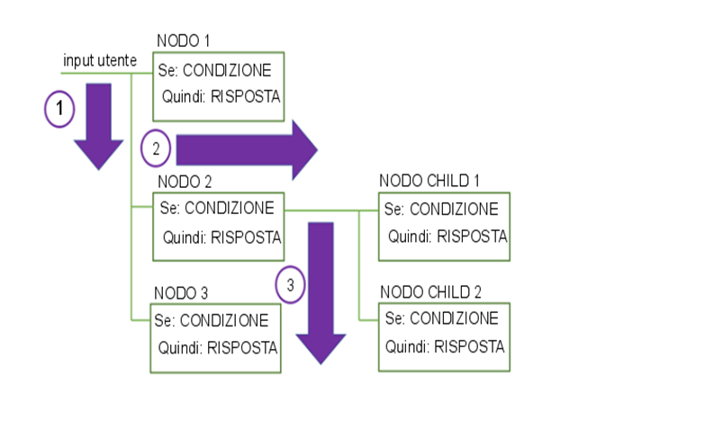

Quando inizi a creare il dialogo, devi stabilire i rami da includere e dove posizionarli. L'ordine dei rami è importante in quanto i nodi vengono valutati dall'alto verso il basso. Viene utilizzato il primo nodo di base la cui condizione corrisponde all'input; tutti i nodi situati più in basso nella struttura ad albero non vengono attivati.

## Condizioni
{: #conditions}

Una condizione del nodo determina se il nodo viene utilizzato nella conversazione. Le condizioni della risposta determinano la risposta da visualizzare all'utente.
Per definire una condizione, puoi utilizzare una o più delle seguenti risorse in qualsiasi combinazione:

- **Variabile di contesto**: il nodo viene utilizzato se l'espressione di variabili di contesto da te specificata è true. Utilizza la sintassi `$variable_name:value` o `$variable_name == 'value'`. Vedi [Variabili di contesto](#context).

  Non definire una condizione di nodo o riposta in base al valore di una variabile di contesto nello stesso nodo di dialogo in cui imposti il valore della variabile di contesto.
  {: tip}

- **Entità**: il nodo viene utilizzato quando qualsiasi valore o sinonimo dell'entità viene riconosciuto nell'input utente. Utilizza la sintassi `@entity_name`. Ad esempio, `@city`.

  Assicurati di creare un nodo peer per gestire il caso in cui nessuno dei valori o sinonimi dell'entità venga riconosciuto.
  {: tip}

- **Valore entità**: il nodo viene utilizzato se il valore dell'entità viene rilevato nell'input utente. Utilizza la sintassi `@entity_name:value`. Ad esempio: `@city:Boston`. Specifica un valore definito per l'entità, non un sinonimo.

  Se controlli la presenza dell'entità, senza specificarne un particolare valore, in un nodo peer assicurati di posizionare il nodo che controlla questo particolare valore di entità sopra di esso.
{: tip}

- **Intento**: la condizione più semplice è un singolo intento. Il nodo viene utilizzato se l'input dell'utente viene associato a tale intento. Utilizza la sintassi `#intent-name`. Ad esempio, `#weather` controlla se l'intento rilavato nell'input utente è `weather`. Se è così, il nodo viene elaborato.

- **Condizione speciale**: condizioni fornite con il servizio che puoi utilizzare per eseguire funzioni di dialogo comuni. 

  <table>
  <tr>
    <td>Nome condizione</td>
    <td>Descrizione</td>
  </tr>
  <tr>
    <td>anything_else</td>
    <td>Puoi utilizzare questa condizione alla fine di un dialogo, affinché venga elaborata quando l'input utente non corrisponde a nessun altro nodo di dialogo. Il nodo **Altro** viene attivato da questa condizione.</td>
  </tr>
  <tr>
    <td>conversation_start</td>
    <td>Come **welcome**, questa condizione viene valutata come true durante il primo turno di dialogo. A differenza di **welcome**, è true a prescindere che la richiesta iniziale dall'applicazione contenga o meno l'input utente. Un nodo con la condizione **conversation_start** può essere utilizzato per inizializzare le variabili di contesto o per eseguire altre attività all'inizio del dialogo.</td>
  </tr>
  <tr>
    <td>false</td>
    <td>Questa condizione viene sempre valutata come false. Potresti utilizzarla all'inizio di un ramo in fase di sviluppo, per impedire che venga utilizzato, o come condizione per un nodo che fornisce una funzione comune ed è utilizzato solo come destinazione di un'azione **Passa a**.</td>
  </tr>
  <tr>
    <td>irrelevant</td>
    <td>Questa condizione viene valutata come true se l'input dell'utente viene considerato irrilevante dal servizio di conversazione.</td>
  </tr>
  <tr>
    <td>true</td>
    <td>Questa condizione viene sempre valutata come true. Puoi utilizzarla alla fine di un elenco di nodi o risposte per recuperare eventuali risposte che non corrispondono a nessuna delle condizioni precedenti.</td>
  </tr>
  <tr>
    <td>welcome</td>
    <td>Questa condizione viene valutata come true durante il primo turno di dialogo (all'inizio della conversazione), solo se la richiesta iniziale dall'applicazione non contiene alcun input utente. Viene valutata come false in tutti i turni di dialogo successivi. Il nodo **Benvenuto** viene attivato da questa condizione. In genere, un nodo con questa condizione viene utilizzato per salutare l'utente, ad esempio, per visualizzare un messaggio come "Benvenuto alla nostra applicazione di ordinazione della pizza".</td>
  </tr>
  </table>

### Sintassi delle condizioni

Utilizza una di queste opzioni di sintassi per creare espressioni valide nelle condizioni:

- Linguaggio Spring Expression (SpEL), che è un linguaggio delle espressioni che supporta l'esecuzione di query e la manipolazione di un grafico di oggetti in fase di runtime. Per ulteriori informazioni, vedi [Linguaggio Spring Expression Language (SpEL)](http://docs.spring.io/spring/docs/current/spring-framework-reference/html/expressions.html){: new_window}.

- Notazioni abbreviate che si riferiscono a intenti, entità e variabili di contesto. Vedi [Accesso e valutazione degli oggetti](expression-language.html).

Utilizza le espressioni regolari per controllare i valori nella condizione.  Per trovare una stringa corrispondente, puoi utilizzare ad esempio il metodo `String.find`. Per ulteriori dettagli, vedi [Metodi](dialog-methods.html).

### Suggerimenti sull'utilizzo delle condizioni

- Se vuoi valutare solo il valore della prima istanza rilevata di un tipo di entità, puoi utilizzare la sintassi  `@entity == 'specific-value'` invece del formato `@entity:(specific-value)`. Ad esempio, quando utilizzi `@appliance == 'air conditioner'`, valuti solo il valore della prima entità `@appliance` rilevata. Ma, l'utilizzo di `@appliance:(air conditioner)` viene esteso in `entity['appliance'].contains('air conditioner')`, che corrisponde ogni volta che viene rilevata almeno un'entità `@appliance` di valore 'air conditioner' nell'input utente. 
- Quando utilizzi variabili numeriche, assicurati che le variabili abbiano dei valori. Se una variabile non ha un valore, viene considerata come avente un valore null (0) in un confronto numerico. Ad esempio, se controlli il valore di una variabile con la condizione `@price < 100` e l'entità @price è null, la condizione verrà valutata come `true` perché 0 è inferiore a 100, anche se il prezzo non è stato mai impostato. Per impedire il controllo delle variabili null, utilizza una condizione come `@price AND @price < 100`. Se @price non ha alcun valore, questa condizione restituirà correttamente false.
- Se utilizzi un'entità come condizione ed è abilitata la corrispondenza fuzzy, `@entity_name` viene valutato su true solo se l'affidabilità della corrispondenza è superiore al 30%.  Ossia, solo se `@entity_name.confidence > .3`.

## Risposte
{: #responses}

La risposta del dialogo definisce come rispondere all'utente.

Puoi rispondere con uno di questi tipi di risposta:

- [Risposta di testo semplice](#simple-text)
- [Risposte multiple condizionate](#multiple)
- [Risposta complessa](#complex)

### Risposta di testo semplice
{: #simple-text}

Se vuoi fornire una risposta di testo, immetti semplicemente il testo che vuoi che il servizio visualizzi all'utente. 

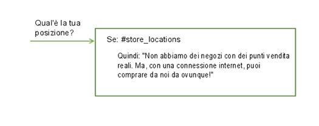

#### Aggiunta di varietà
{: #variety}

Se i tuoi utenti utilizzano spesso il tuo servizio di conversazione, potrebbero essere stanchi di ascoltare ogni volta gli stessi messaggi iniziali e le stesse risposte. Puoi aggiungere delle *variazioni* alle tue risposte in modo che la conversazione possa rispondere alla stessa condizione in modi diversi.

<iframe class="embed-responsive-item" id="youtubeplayer" type="text/html" width="640" height="390" src="https://www.youtube.com/embed/nAlIW3YPrAs?rel=0" frameborder="0" webkitallowfullscreen mozallowfullscreen allowfullscreen> </iframe>

In questo esempio, la risposta che il servizio fornisce alle domande relative alle posizioni del negozio differisce da un'interazione all'altra. 

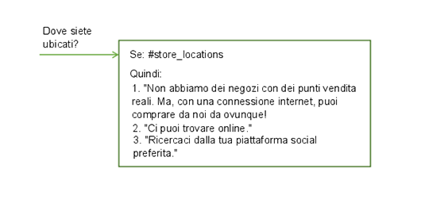

Puoi scegliere di ruotare le variazioni di risposta in sequenza o in ordine casuale. Per impostazione predefinita, le risposte vengono ruotate in sequenza, come se fossero scelte da un elenco ordinato.

### Risposte condizionate
{: #multiple}

Un singolo nodo di dialogo può fornire risposte diverse, ognuna attivata da una diversa condizione.  Utilizza questo approccio per risolvere più scenari in un singolo nodo.

<iframe class="embed-responsive-item" id="youtubeplayer" type="text/html" width="640" height="390" src="https://www.youtube.com/embed/KcvVQAsnhLM?rel=0" frameborder="0" webkitallowfullscreen mozallowfullscreen allowfullscreen> </iframe>

Il nodo ha ancora una condizione principale, che è la condizione per l'utilizzo del nodo e l'elaborazione delle condizioni e delle risposte che contiene.

In questo esempio, il servizio utilizza le informazioni sulla posizione dell'utente raccolte in precedenza per personalizzare la risposta e fornire informazioni sul negozio più vicino all'utente. Vedi [Variabili di contesto](#context) per ulteriori informazioni su come memorizzare le informazioni raccolte dall'utente.


Questo singolo nodo fornisce ora la funzione equivalente di quattro nodi separati.

Le condizioni all'interno di un nodo vengono valutate in ordine, proprio come i nodi.  Assicurati che le tue condizioni e risposte siano elencate nell'ordine corretto.  Se devi modificare l'ordine, seleziona una condizione e spostala in alto o in basso nell'elenco utilizzando le frecce visualizzate. Se vuoi aggiornare il contesto, devi farlo in ogni singola risposta.  Non esiste una sezione di risposta comune. L'azione **Passa a** viene elaborata dopo che viene selezionata e consegnata una risposta. Se aggiungi un'azione **Passa a**, viene eseguita dopo qualsiasi risposta restituita dal nodo.
{: tip}

### Risposta complessa
{: #complex}

Per specificare una risposta più complessa, puoi utilizzare l'editor JSON per specificare la risposta nella proprietà `"output":{}`.

Per includere un valore di variabile di contesto nella risposta, utilizza la sintassi `$variable-name` per specificarlo. Per ulteriori informazioni, vedi [Variabili di contesto](#context).

```json
{
  "output": {
    "text": "Hello $user"
  }
}
```
{: codeblock}

Per specificare più di un'istruzione da visualizzare in righe separate, definisci l'output come un array JSON.

```json
{
  "output": {
    "text": ["Hello there.", "How are you?"]
  }
}
```
{: codeblock}

La prima frase viene visualizzata su una riga e la seconda frase viene visualizzata come nuova riga sotto di essa.

Per implementare un comportamento più complesso, puoi definire il testo di output come un oggetto JSON complesso. Ad esempio, puoi utilizzare un oggetto complesso nell'output JSON per simulare il comportamento di aggiungere variazioni di risposta al nodo. Nell'oggetto complesso, puoi includere le seguenti proprietà:

- **values**: un array di stringhe JSON che contiene più versioni del testo di output che può essere restituito da questo nodo di dialogo. L'ordine in cui vengono restituiti i valori nell'array dipende dall'attributo `selection_policy`.

- **selection_policy**: sono validi i seguenti valori:

    - **random**: il sistema seleziona in modo casuale il testo di output dall'array di `values` e non li ripete in modo consecutivo. Ad esempio, considera output.text che contiene tre valori. Per le prime tre volte, viene selezionato un valore casuale ma non viene ripetuto un'altra volta. Dopo che sono stati forniti tutti i valori di output, il sistema seleziona in modo casuale un altro valore e ripete il processo.

        ```json
        {
            "output":{
                "text":{
                    "values":["Hello.","Hi.","Howdy!"],
                    "selection_policy":"random"
                }
            }
        }
        ```
        {: codeblock}

    Il sistema restituisce un messaggio iniziale da queste tre opzioni che sceglie a caso. La prossima volta che viene attivata la risposta, viene visualizzato un altro messaggio iniziale dall'elenco. Il messaggio iniziale viene di nuovo scelto a caso, salvo che il messaggio utilizzato in precedenza non sia intenzionalmente ripetuto.

    - **sequential**: il sistema restituisce il primo testo di output la prima volta che il nodo di dialogo viene attivato, il secondo testo di output la seconda volta che il nodo viene attivato e così via. 

        ```json
        {
            "output":{
                "text":{
                    "values":["Hello.", "Hi.", "Howdy!"],
                    "selection_policy":"sequential"
                }
            }
        }
        ```
        {: codeblock}

- **append**: specifica se aggiungere un valore a un array o sovrascrivere i valori nell'array con uno o più nuovi valori. Se impostato su false, l'output raccolto nei nodi di dialogo eseguiti in precedenza viene sovrascritto dal valore di testo specificato in questo determinato nodo.

    ```json
    {
        "output":{
            "text":{
                "values": ["Hello."],
                "append":false
            }
        }
    }
    ```
    {: codeblock}

    In questo caso, tutto l'altro testo di output viene sovrascritto da questo testo di output.

Il comportamento predefinito presuppone `selection_policy = random` e `append = true`. Quando l'array di valori contiene più di una voce, il testo di output viene selezionato casualmente dai suoi elementi.

### Definizione delle operazioni successive
{: #jump-to}

Dopo aver eseguito la risposta specificata, puoi istruire il servizio affinché effettui una delle seguenti operazioni:

- **Attendi input utente**: il servizio attende che l'utente fornisca un nuovo input indotto dalla risposta. Ad esempio, la risposta potrebbe chiedere all'utente una domanda "sì o no". Il dialogo non avanzerà finché l'utente non fornisce altro input.
- **Passa a un altro nodo di dialogo**: utilizza questa opzione se desideri ignorare l'attesa dell'input utente e vuoi che la conversazione vada direttamente ai nodi figlio o a un nodo di dialogo completamente diverso. Puoi utilizzare un'azione Passa a, ad esempio, per instradare il flusso in un nodo di dialogo comune da più posizioni nella struttura ad albero.
  >Nota: il nodo di destinazione a cui vuoi passare deve esistere prima di poter configurare e quindi utilizzare l'azione Passa a.

#### Configurazione dell'azione Passa a

Se scegli di passare a un altro nodo, devi specificare se l'azione è destinata alla **risposta** o alla **condizione** del nodo di dialogo selezionato

- **Risposta**: se l'istruzione è destinata alla parte della risposta del nodo di dialogo selezionato, viene eseguita immediatamente. Ovvero, il sistema non valuta la parte della condizione del nodo di dialogo selezionato ed esegue immediatamente la parte della risposta. 

  La specifica della risposta è utile per concatenare insieme più nodi di dialogo. La parte della risposta del nodo di dialogo selezionato viene elaborata come se la condizione di questo nodo di dialogo fosse true. Se il nodo di dialogo selezionato ha un'altra azione **Passa a**, anche tale azione viene eseguita immediatamente.
- **Condizione**: se l'istruzione è destinata alla parte della condizione del nodo di dialogo selezionato, il servizio verifica prima se la condizione del nodo di destinazione viene valutata come true.
    - Se la condizione viene valutata come true, il sistema elabora immediatamente questo nodo aggiornando il contesto con il contesto del nodo di dialogo e l'output con l'output del nodo di dialogo. 
    - Se la condizione non viene valutata come true, il sistema continua il processo di valutazione di una condizione del nodo di pari livello successivo del nodo di dialogo di destinazione e così via, finché non trova un nodo di dialogo con una condizione valutata come true.
    - Se il sistema elabora tutti i nodi di pari livello e nessuna condizione viene valutata come true, verrà utilizzata la strategia di fallback di base e il dialogo valuterà anche i nodi al livello superiore.

    La specifica della condizione è utile per concatenare le condizioni dei nodi di dialogo. Ad esempio, potresti voler prima verificare se l'input contiene un intento, come `#turn_on`, e se lo contiene, potresti voler controllare se l'input contiene entità, come `@lights`, `@radio` o `@wipers`. Il concatenamento di condizioni aiuta a strutturare alberi di dialogo più grandi.

**Nota**: l'elaborazione delle azioni **Passa a** è cambiata con la release del 3 febbraio 2017. Per ulteriori dettagli, vedi [Aggiornamento del tuo spazio di lavoro](upgrading.html){: new_window}.

#### Ulteriori informazioni

Per informazioni sul linguaggio delle espressioni utilizzato dal dialogo, oltre ai metodi, alle entità di sistema e altri dettagli utili, vedi la sezione Riferimento nel riquadro di navigazione.

## Variabili di contesto
{: #context}

Il dialogo è privo di stato, il che significa che non conserva le informazioni da un interscambio con l'utente all'altro. La tua applicazione è responsabile del mantenimento di tutte le informazioni continue di cui ha bisogno. Tuttavia, l'applicazione può passare le informazioni al dialogo e il dialogo può aggiornare queste informazioni e ritrasmetterle all'applicazione. Per farlo, utilizza le variabili di contesto.

Una variabile di contesto è una variabile che definisci in un nodo e per la quale puoi facoltativamente specificare un valore predefinito. Altri nodi o la logica di applicazione possono successivamente impostare o modificare il valore della variabile di contesto. 

Puoi condizionare i valori delle variabili di contesto facendo riferimento a una variabile di contesto da una condizione del nodo di dialogo per determinare se eseguire un nodo. E puoi fare riferimento a una variabile di contesto dalle condizioni di risposta del nodo di dialogo per mostrare una risposta diversa a seconda del valore fornito da un servizio esterno o dall'utente.

### Passaggio del contesto dall'applicazione

Passa le informazioni dall'applicazione al dialogo impostando una variabile di contesto e passando tale variabile al dialogo.

Ad esempio, la tua applicazione può impostare una variabile di contesto $time_of_day e passarla al dialogo che può utilizzare le informazioni per adattare il messaggio iniziale visualizzato all'utente.

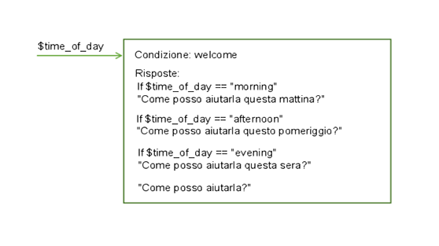

In questo esempio, il dialogo sa che l'applicazione imposta la variabile su uno di questi valori: *morning*, *afternoon* o *evening*. Può controllare ogni valore e, a seconda del valore che è presente, restituisce il messaggio iniziale appropriato. Se la variabile non viene passata o se ha un valore che non corrisponde a uno dei valori previsti, all'utente viene visualizzato un messaggio iniziale più generico.

### Passaggio del contesto da un nodo all'altro

Il dialogo può anche aggiungere variabili di contesto per passare informazioni da un nodo all'altro o per aggiornare i valori delle variabili di contesto. Mentre il dialogo richiede e riceve informazioni dall'utente, può tenere traccia delle informazioni e farvi riferimento nel corso della conversazione.

Ad esempio, in un nodo potresti chiedere agli utenti il loro nome e in un nodo successivo rivolgerti a loro per nome.

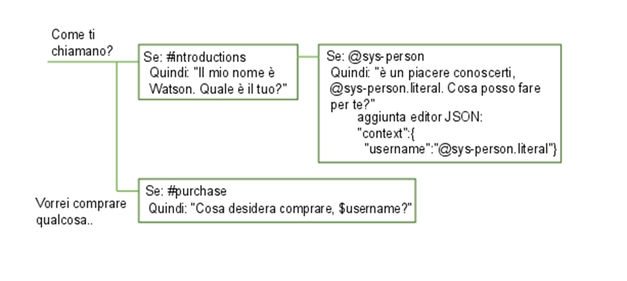

In questo esempio, l'entità di sistema @sys-person viene utilizzata per estrarre il nome dell'utente dall'input,se l'utente ne fornisce uno. Nell'editor JSON, viene definita la variabile di contesto username e viene impostata sul valore @sys-person. In un nodo successivo, la variabile di contesto $username viene inclusa nella risposta per rivolgersi all'utente per nome.

### Definizione di una variabile di contesto

Definisci una variabile di contesto aggiungendo una coppia `name` e `value` nella sezione `{context}` della definizione del nodo di dialogo JSON. La coppia deve soddisfare questi requisiti:

- Il `name` può contenere caratteri alfabetici maiuscoli e minuscoli, caratteri numerici (0-9) e caratteri di sottolineatura.

  **Nota**: nel nome puoi includere altri caratteri, come punti e trattini. Tuttavia, se li includi, devi utilizzare uno dei seguenti approcci per fare riferimento alla variabile:
  - context['variable-name']: The sintassi dell'espressione SpEL completa.
  - $(variable-name): sintassi abbreviata con il nome della variabile racchiuso tra parentesi.

  Per ulteriori dettagli, vedi [Accesso e valutazione degli oggetti](expression-language.html#shorthand-syntax-for-context-variables).

- Il `value` può essere qualsiasi tipo JSON supportato, come una variabile stringa semplice, un numero, un array JSON o un oggetto JSON.

Il seguente esempio JSON definisce i valori per le variabili di contesto di stringa $dessert, array $toppings_array e numero $age:

```json
{
  "context": {
    "dessert": "ice-cream",
    "toppings_array": ["onion", "olives"],
    "age": 18
  }
}
```
{: codeblock}

Per definire una variabile di contesto, completa la seguente procedura:

1.  Dalla vista di modifica del nodo, apri l'editor JSON facendo clic sull'icona  e quindi selezionando **JSON**.

1.  Di fronte al blocco `"output":{}`, aggiungi un blocco `"context":{}` se non è presente.

    ```json
    {
      "context":{},
      "output":{}
    }
    ```
    {: codeblock}

1.  Nel blocco di contesto, aggiungi una coppia di nome e valore per ciascuna variabile di contesto che vuoi definire.

    ```json
    {
      "context":{
        "name": "value"
    },
    ...
    }
    ```
    {: codeblock}

  Per fare successivamente riferimento alla variabile di contesto, utilizza la sintassi `$name` dove *name* è il nome della variabile di contesto che hai definito.

Altre attività comuni includono:

- Per memorizzare l'intera stringa immessa dall'utente, utilizza `input.text`:

    ```json
    {
      "context": {
        "repeat": "<?input.text?>"
      }
    }
    ```
    {: codeblock}

- Per memorizzare il valore di un'entità in una variabile di contesto, utilizza questa sintassi:

    ```json
    {
      "context": {
        "place": "@place"
      }
    }
    ```
    {: codeblock}

- Per memorizzare in una variabile di contesto il valore di una stringa che estrai dall'input utente utilizzando un'espressione regolare, utilizza questa sintassi:

    ```json
    {
      "context": {
         "number": "<?input.text.extract('^[^\\d]*[\\d]{11}[^\\d]*$',0)?>"
      }
    }
    ```
    {: codeblock}

- Per memorizzare il valore di un'entità modello in una variabile di contesto, aggiungi .literal al nome dell'entità. L'utilizzo di questa sintassi assicura che nella variabile venga memorizzata l'esatta parte di testo dell'input utente corrispondente al modello specificato.

    ```json
    {
      "context": {
        "email": "@email.literal"
      }
    }
    ```
    {: codeblock}

### Ordine delle operazioni 
{: #order-of-context-var-ops}

L'ordine in cui definisci le variabili di contesto non determinano l'ordine in cui vengono elaborate dal servizio. Il servizio valuta le variabili, che sono definite come coppie di nome e valore JSON, in ordine casuale. Non impostare un valore nella prima variabile di contesto e sperare di riuscire a utilizzarlo nella seconda, perché non vi è alcuna garanzia che la prima variabile di contesto verrà eseguita prima della seconda nel tuo elenco. Ad esempio, non utilizzare due variabili di contesto per implementare la logica che restituisce un numero casuale tra zero e un valore più alto passato al nodo.

```json
"context": {
    "upper": "<? @sys-number.numeric_value + 1?>",
    "answer": "<? new Random().nextInt($upper) ?>"
}
```
{: codeblock}

Utilizza un'espressione leggermente più complessa per evitare di dover fare affidamento sul valore della variabile di contesto $upper che viene valutata prima della variabile di contesto $answer.

```json
"context": {
    "answer": "<? new Random().nextInt(@sys-number.numeric_value + 1) ?>"
}
```
{: codeblock}

### Aggiornamento di un valore di variabile di contesto
{: #updating-a-context-variable-value}

Se un nodo imposta il valore di una variabile di contesto già impostata, il valore precedente viene sovrascritto.

#### Aggiornamento di un oggetto JSON complesso

I valori precedenti vengono sovrascritti per tutti i tipi JSON tranne che per un oggetto JSON. Se la variabile di contesto è un tipo complesso come un oggetto JSON, viene utilizzata una procedura di unione JSON per aggiornare la variabile. L'operazione di unione aggiunge qualsiasi proprietà appena definita e sovrascrive tutte le proprietà esistenti dell'oggetto

In questo esempio, una variabile di contesto di nome è definita come un oggetto complesso.

```json
{
  "context": {
    ...
    "complex_object": {
      "user_firstname" : "Paul",
      "user_lastname" : "Pan"
      "has_card" : false
    }
  }
}
```
{: codeblock}

Un nodo di dialogo aggiorna l'oggetto JSON della variabile di contesto con i seguenti valori:

```json
{
  "complex_object": {
    "user_firstname": "Peter",
    "has_card": true
  }
}
```
{: codeblock}

Il risultato è il seguente contesto:

```json
{
  "complex_object": {
    "user_firstname": "Peter",
    "user_lastname": "Pan",
    "has_card": true
  }
}
```
{: codeblock}

#### Aggiornamento di array

Se i tuoi dati di contesto del dialogo contengono un array di valori, puoi aggiornare l'array aggiungendo valori, rimuovendo un valore o sostituendo tutti i valori. 

Per aggiornare l'array, scegli una delle seguenti azioni. In ogni caso, vedremo l'array prima dell'azione, l'azione e l'array dopo che l'azione è stata applicata.

- **Aggiungi**: per aggiungere valori alla fine di un array, utilizza il metodo `append`.

    Per questo contesto di runtime di dialogo:

    ```json
    {
      "context": {
        "toppings_array": ["onion", "olives"]
      }
    }
    ```
    {: codeblock}

    Effettua questo aggiornamento:

    ```json
    {
      "context": {
        "toppings_array": "<? $toppings_array.append('ketchup', 'tomatoes') ?>"
      }
    }
    ```
    {: codeblock}

    Risultato:

    ```json
    {
      "context": {
        "toppings_array": ["onion", "olives", "ketchup", "tomatoes"]
      }
    }
    ```
    {: codeblock}

- **Rimuovi**: per rimuovere un elemento, utilizza il metodo `remove` e specifica il suo valore o la sua posizione nell'array.

    - **Rimuovi per valore**: rimuove un elemento da un array in base al suo valore.

        Per questo contesto di runtime di dialogo:

        ```json
        {
          "context": {
            "toppings_array": ["onion", "olives"]
          }
        }
        ```
        {: codeblock}

        Effettua questo aggiornamento:

        ```json
        {
          "context": {
            "toppings_array": "<? $toppings_array.removeValue('onion') ?>"
          }
        }
        ```
        {: codeblock}

        Risultato:

        ```json
        {
          "context": {
            "toppings_array": ["olives"]
          }
        }
        ```
        {: codeblock}

    - **Rimuovi per posizione**: rimozione di un elemento da un array in base alla sua posizione nell'indice.

        Per questo contesto di runtime di dialogo:

        ```json
        {
          "context": {
            "toppings_array": ["onion", "olives"]
          }
        }
        ```
        {: codeblock}

        Effettua questo aggiornamento:

        ```json
        {
          "context": {
            "toppings_array": "<? $toppings_array.remove(0) ?>"
          }
        }
        ```
        {: codeblock}

        Risultato:

        ```json
        {
          "context": {
            "toppings_array": ["olives"]
          }
        }
        ```
        {: codeblock}

- **Sovrascrivi**: per sovrascrivere i valori in un array, imposta semplicemente l'array sui nuovi valori:

    Per questo contesto di runtime di dialogo:

        ```json
        {
          "context": {
            "toppings_array": ["onion", "olives"]
          }
        }
        ```
        {: codeblock}

    Effettua questo aggiornamento:

        ```json
        {
          "context": {
            "toppings_array": ["ketchup", "tomatoes"]
          }
        }
        ```
        {: codeblock}

    Risultato:

        ```json
        {
          "context": {
            "toppings_array": ["ketchup", "tomatoes"]
          }
        }
        ```
        {: codeblock}

**Attenzione**: se salvi l'array come parte di una stringa, diventa un oggetto Stringa anziché un Array. Ad esempio, la seguente variabile di contesto $array è un array, ma la variabile di contesto $string_array è una stringa.

```json
{
  "context": {
    "array": [
      "one",
      "two"
    ],
    "array_in_string": "this is my array: $array"
  }
}
```
{: codeblock}

Se controlli i valori di queste variabili di contesto nel riquadro Provalo, vedrai i valori specificati come segue:

**$array** : `["one","two"]`

**$array_in_string** : `"this is my array: [\"one\",\"two\"]"`

Successivamente, puoi eseguire i metodi array sulla variabile $array, ad esempio `<? $array.removeValue('two') ?>` ma non sulla variabile $array_in_string.

## Creazione di un dialogo
{: #create}

Utilizza lo strumento {{site.data.keyword.conversationshort}} per creare un dialogo.

### Limiti di nodi del dialogo
{: #dialog-node-limits}

Il numero di nodi di dialogo che puoi creare dipende dal tuo piano di servizio.

| Piano di servizio    | Nodi di dialogo per spazio di lavoro |
|------------------|---------------------------:|
| Standard/Premium |                    100.000 |
| Lite             |                     25.000 |

Limite di profondità della struttura ad albero: il servizio supporta 2.000 discendenti del nodo di dialogo, gli strumenti rendono al meglio con 20 o meno.

### Procedura

Per creare un dialogo, completa la seguente procedura:

1.  Apri la pagina **Build** dalla barra di navigazione, fai clic sulla scheda **Dialogo** e quindi su **Crea**.

    Quando apri il builder di dialoghi per la prima volta, vengono creati automaticamente i seguenti nodi:
    - **Benvenuto**: il primo nodo. Contiene un messaggio iniziale che viene visualizzato agli utenti la prima volta che si collegano al servizio. Puoi modificare il messaggio iniziale.
    - **Altro**: il nodo finale. Contiene frasi che vengono utilizzate per rispondere agli utenti quando il loro input non viene riconosciuto. Puoi sostituire le risposte fornite o aggiungere altre risposte con un significato simile per aggiungere varietà alla conversazione. Inoltre, puoi scegliere che il servizio restituisca ogni risposta definita a turno o in ordine casuale.
1.  Per aggiungere altri nodi alla struttura ad albero del dialogo, fai clic sull'icona **Altro**  sul nodo **Benvenuto** e seleziona quindi **Aggiungi nodo in basso**.
1.  Immetti una condizione che, quando soddisfatta, attivi il servizio per elaborare il nodo.

    Quando inizi a definire una condizione, viene visualizzata una casella che mostra le tue opzione. Puoi immettere uno dei seguenti caratteri e quindi scegliere un valore dall'elenco di opzioni che viene visualizzato.

    <table>
    <tr>
      <td>Carattere</td>
      <td>Elenca i valori definiti per questi tipo di risorsa</td>
    </tr>
    <tr>
      <td>`#`</td>
      <td>intenti</td>
    </tr>
    <tr>
      <td>`@`</td>
      <td>entità</td>
    </tr>
    <tr>
      <td>`@{entity-name}:`</td>
      <td>valori {entity-name}</td>
    </tr>
    <tr>
      <td>`$`</td>
      <td>variabili di contesto che hai definito o indicato altrove nel dialogo</td>
    </tr>
    </table>

    Puoi creare un nuovo intento, entità, valore di entità o variabile di contesto definendo una nuova condizione che lo utilizzi. Se crei una risorsa in questo modo, assicurati di tornare indietro e di completare tutti gli altri passi necessari affinché la risorsa venga creata in modo completo, ad esempio la definizione delle espressioni di esempio per un intento.

    Per definire un nodo che viene attivato in base a più di una condizione, immetti una condizione e fai quindi clic sull'icona di segno più (+) accanto ad essa. Se vuoi applicare un operatore `OR` alle condizioni multiple anziché `AND`, fai clic su `and` visualizzato tra i campi per cambiare il tipo di operatore. Le operazioni AND vengono eseguite prima delle operazioni OR, ma puoi modificare l'ordine utilizzando le parentesi. Ad esempio:
    `$isMember:true AND ($memberlevel:silver OR $memberlevel:gold)`

    La condizione che definisci deve avere una lunghezza massima di 500 caratteri.

    Per ulteriori informazioni su come testare i valori nelle condizioni, vedi [Condizioni](#conditions).
1.  **Facoltativo**: se vuoi raccogliere più informazioni dall'utente in questo nodo, fai clic su **Personalizza** e abilita **Slot**. Per ulteriori dettagli, vedi [Raccolta di informazioni con gli slot](#slots).
1.  Immetti una risposta.
    - Aggiungi il testo che vuoi che il servizio visualizzi all'utente come risposta.
    - Per informazioni sulle risposte condizionali, come aggiungere varietà alle risposte o come specificare cosa deve succedere dopo che il nodo viene attivato, vedi [Risposte](#responses).
1.  **Facoltativo**: fornisci un nome per il nodo.

    Il nome del nodo di dialogo può contenere lettere (in Unicode), numeri, spazi, caratteri di sottolineatura, trattini e punti.

    La denominazione del nodo rende più facile ricordare il suo scopo e individuare il nodo quando è ridotto al minimo. Se non fornisci un nome, la condizione del nodo viene utilizzata come nome.

1.  Per aggiungere altri nodi, seleziona un nodo nella struttura ad albero e fai clic sull'icona **Altro** .
    - Per creare un nodo peer che venga controllato successivamente se la condizione per il nodo esistente non viene soddisfatta, seleziona **Aggiungi nodo in basso**.
    - Per creare un nodo peer che venga controllato prima di verificare la condizione per il nodo esistente, seleziona **Aggiungi nodo in alto**.
    - Per creare un nodo figlio per il nodo selezionato, seleziona **Aggiungi nodo figlio**. Un nodo figlio viene elaborato dopo il suo nodo padre.

    Per ulteriori informazioni sull'ordine in cui vengono elaborati i nodi di dialogo, vedi [Panoramica del dialogo](#overview).
1.  Verifica il dialogo mentre lo crei.
   Per ulteriori informazioni, vedi [Test del dialogo](#test).

## Raccolta di informazioni con gli slot
{: #slots}

Aggiungi gli slot a un nodo di dialogo per raccogliere più informazioni da un utente all'interno di tale nodo. Gli slot raccolgono informazioni al ritmo dell'utente. I dettagli che l'utente fornisce all'inizio vengono salvati e il servizio chiede solo i dettagli che non lo sono.

<iframe class="embed-responsive-item" id="youtubeplayer" type="text/html" width="640" height="390" src="https://www.youtube.com/embed/ES4GHcDsSCI?rel=0" frameborder="0" webkitallowfullscreen mozallowfullscreen allowfullscreen> </iframe>

### Perché aggiungere slot?
{: #why-add-slots}

Utilizza gli slot per ottenere le informazioni necessarie prima di poter rispondere con precisione all'utente. Ad esempio, se gli utenti chiedono informazioni sulle ore lavorative, ma le ore differiscono in base alle posizioni del negozio, potresti porre una domanda di follow-up sulla posizione del negozio che intendono visitare prima di rispondere. Puoi quindi aggiungere condizioni di risposta che tengano conto delle informazioni sulla posizione fornite.

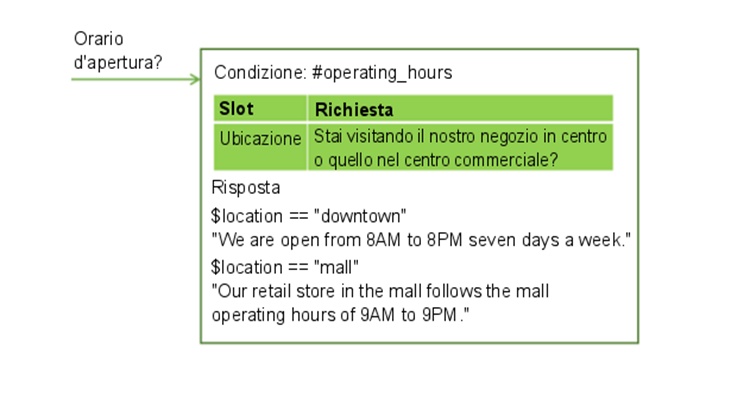

Gli slot possono aiutarti a raccogliere ulteriori informazioni necessarie per completare un'attività complessa per un utente, ad esempio prenotare una cena. 

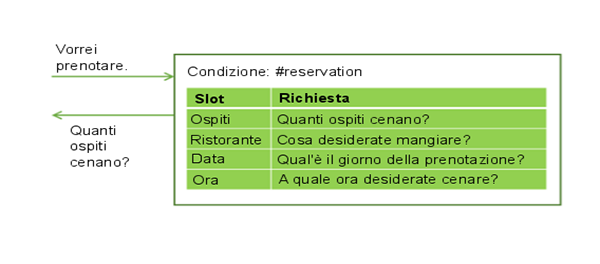

L'utente potrebbe fornire valori per più slot contemporaneamente. Ad esempio, l'input potrebbe includere l'informazione "Saremo in 6 a cenare alle 7 PM." Questo solo input contiene due dei valori richiesti mancanti: il numero di ospiti e l'ora della prenotazione. Il servizio li riconosce e li memorizza entrambi, ciascuno nel suo slot corrispondente. Quindi, visualizza la richiesta associata al successivo slot vuoto.

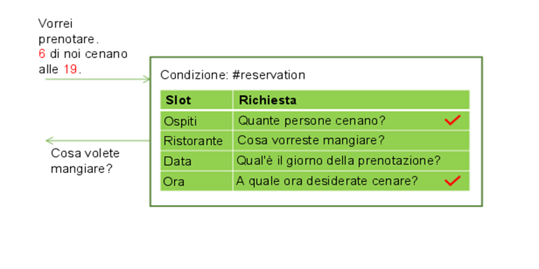

Gli slot consentono al servizio di rispondere alle domande di follow-up senza dover ricostruire l'obiettivo dell'utente. Ad esempio, un utente potrebbe chiedere una previsione meteorologica, quindi fare una domanda di follow-up sul tempo in un'altra posizione o per un altro giorno. Se salvi negli slot le variabili di previsione richieste, come la posizione e il giorno, qualora un utente faccia una domanda di follow-up con nuovi valori di variabile, puoi sovrascrivere i valori di slot con i nuovi valori forniti e dare una risposta che rifletta le nuove informazioni.

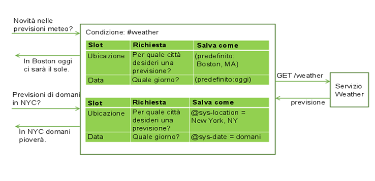

L'utilizzo di slot produce un flusso di dialogo più naturale tra l'utente e il servizio ed è più facile da gestire che cercare di raccogliere le informazioni utilizzando molti nodi separati.

#### Aggiunta di slot
{: #add-slots}

1.  Identifica le unità di informazioni che vuoi raccogliere. Ad esempio, per ordinare una pizza per qualcuno, puoi raccogliere le seguenti informazioni:

    - Tempo di consegna
    - Dimensione

1.  Dalla vista di modifica del nodo di dialogo, fai clic su **Personalizza** e quindi seleziona la casella di spunta **Slot**.

    **Nota**: per ulteriori informazioni sul campo **Richiedi tutto**, vedi [Chiedere tutto in una volta](dialog-build.html#slots-prompt-for-everything).

1.  **Aggiungi uno slot per ogni unità di informazioni richieste**.

    Per ogni slot, specifica i seguenti dettagli:

    - **Controlla**: identifica il tipo di informazioni che vuoi estrarre dalla risposta dell'utente alla richiesta dello slot. Nella maggior parte dei casi controlli i valori di entità, ma puoi anche controllare un intento. Puoi utilizzare qui gli operatori AND e OR per definire condizioni più complesse.

      **Nota**: se per l'entità sono definiti dei modelli, dopo aver aggiunto il nome entità, aggiungi `.literal` al nome. Ad esempio, dopo aver scelto `@email` dall'elenco di entità definite, modifica il campo *Controlla* in modo da contenere `@email.literal`. Aggiungendo la proprietà `.literal`, indichi che vuoi acquisire il testo esatto immesso dall'utente e che è stato identificato come un indirizzo email basato sul suo modello.

      Evita di controllare i valori delle variabili di contesto. Il valore *Controlla* viene prima utilizzato come condizione, ma poi diventa il valore della variabile di contesto che specifichi nel campo *Salva con nome*. Se utilizzi una variabile di contesto nella condizione, può produrre un comportamento imprevisto quando viene utilizzata nel contesto.
      {: tip}

    - **Salva con nome**: fornisci un nome per la variabile di contesto in cui memorizzare il valore di interesse dalla risposta dell'utente alla richiesta dello slot. Non specificare una variabile di contesto utilizzata in precedenza nel dialogo e che quindi potrebbe avere un valore. La richiesta per lo slot viene visualizzata solo quando la variabile di contesto per lo slot è null.

    - **Richiesta**: scrivi un'istruzione che induca l'utente a fornire le informazioni che ti servono. Dopo aver visualizzato questa richiesta, la conversazione si interrompe e il servizio attende che l'utente risponda.

    - Se modifichi lo slot, puoi definire anche le risposte da mostrare dopo che l'utente risponde alla richiesta dello slot.
      - **Trovato**: eseguito dopo che l'utente fornisce le informazioni previste.
      - **Non trovato**: eseguito se le informazioni fornite dall'utente non vengono comprese o non sono fornite nel formato previsto. Il testo che specifichi qui può indicare più esplicitamente il tipo di informazioni che l'utente deve fornire. Se lo slot è riempito correttamente o l'input utente viene compreso e gestito da un gestore a livello di nodo, questa condizione non viene mai attivata.

    Questa tabella mostra valori di slot di esempio per un nodo che aiuta gli utenti a fare un ordine per una pizza.

    <table>
    <tr>
      <td>Informazioni</td>
      <td>Controlla</td>
      <td>Salva con nome</td>
      <td>Richiesta</td>
      <td>Follow-up se trovato</td>
      <td>Follow-up se non trovato</td>
    </tr>
    <tr>
      <td>Dimensione</td>
      <td>@size</td>
      <td>$size</td>
      <td>"Quale formato di pizza preferisci?"</td>
      <td>"$size it is."</td>
      <td>"Quale formato volevi? Abbiamo piccolo, medio e grande."</td>
    </tr>
    <tr>
      <td>DeliverBy</td>
      <td>@sys-time</td>
      <td>$time</td>
      <td>"Quando hai bisogno della pizza?"</td>
      <td>"Per la consegna entro $time."</td>
      <td>"A che ora desideri la consegna? Abbiamo bisogno di almeno mezz'ora per prepararla."</td>
    </tr>
    </table>

    **Slot facoltativi**: se vuoi aggiungere uno slot che acquisisca informazioni, ma è facoltativo, non specificare un prompt per esso.

    Ad esempio, potresti aggiungere uno slot che acquisisce informazioni di restrizione dietetica nel caso in cui l'utente le specifichi. Tuttavia, non vuoi chiedere a tutti gli utenti informazioni dietetiche in quanto è irrilevante nella maggior parte dei casi.

    <table>
    <tr>
      <td>Informazioni</td>
      <td>Controlla</td>
      <td>Salva con nome</td>
    </tr>
    <tr>
      <td>Restrizione grano</td>
      <td>@dietary</td>
      <td>$dietary</td>
    </tr>
    </table>

    Quando aggiungi uno slot senza una richiesta, il servizio considera lo slot come facoltativo.

    Se rendi uno slot facoltativo, fai riferimento alla sua variabile di contesto nel testo di risposta a livello di nodo solo se puoi formularlo in modo che abbia senso, anche se non viene fornito alcun valore per lo slot. Ad esempio puoi formulare un'istruzione di riepilogo come questa, "Voglio ordinare una pizza $size $dietary da consegnare alle $time." Il testo risultante ha ancora senso anche se le informazioni di restrizione dietetica , come `gluten-free` o `dairy-free` non sono fornite, "Voglio ordinare una pizza grande da consegnare alle 3:00PM."
    {: tip}
1.  **Mantieni la conversazione degli utenti**.
    Puoi definire facoltativamente dei gestori a livello di nodo che forniscano risposte alle domande che gli utenti potrebbero porre durante l'interazione e che sono tangenti allo scopo del nodo. 

    Ad esempio, l'utente potrebbe chiedere la ricetta della salsa di pomodoro o dove ottieni i tuoi ingredienti. Per gestire tali digressioni, fai clic sul link **Gestisci gestori** e aggiungi una condizione e una riposta per ogni domanda anticipata.

    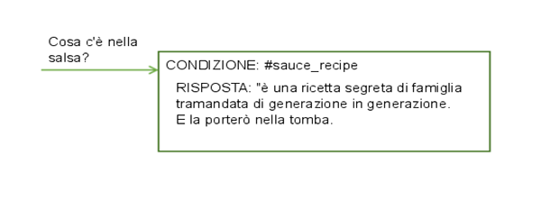

    Dopo aver risposto alla digressione, viene visualizzata la richiesta associata allo slot vuoto corrente.

    Questa condizione viene attivata se l'utente fornisce un input che corrisponde alle condizioni del gestore in qualsiasi momento durante il flusso del nodo di dialogo finché non viene visualizzata la risposta a livello di nodo.
1.  **Aggiungi una risposta a livello di nodo**.
    Questa risposta a livello di nodo non viene eseguita fino a quando non vengono riempiti tutti gli slot richiesti. Puoi aggiungere una risposta che riepiloghi le informazioni che hai raccolto. Ad esempio, "A `$size` pizza is scheduled for delivery at `$time`. Enjoy!"

1.  **Aggiungi la logica che reimposta le variabili di contesto degli slot**.
    Quando raccogli le risposte dell'utente per ogni slot, queste vengono salvate in variabili di contesto. Puoi utilizzare le variabili di contesto per passare le informazioni a un altro nodo o affinché vengano utilizzate da un'applicazione o un servizio esterno. Tuttavia, dopo aver passato le informazioni, devi impostare le variabili di contesto su null per reimpostare il nodo in modo che possa iniziare a raccogliere di nuovo le informazioni. Non puoi impostare su null le variabili di contesto all'interno del nodo corrente perché il servizio non esce dal nodo finché non vengono riempiti tutti gli slot richiesti. Invece, prendi in considerazione uno dei seguenti metodi:
    - Aggiungi l'elaborazione all'applicazione esterna che imposta su null le variabili.
    - Aggiungi un nodo figlio che imposta su null le variabili.
    - Inserisci un nodo padre che imposta su null le variabili e poi passa al nodo con gli slot.

Prendi in considerazione questi approcci consigliati per la gestione delle attività comuni.

#### Chiedere tutto in una volta
{: #slots-prompt-for-everything}

Includi una richiesta iniziale per l'intero nodo che indichi chiaramente agli utenti quali unità di informazioni devono fornire. La visualizzazione di questa richiesta iniziale dà agli utenti l'opportunità di fornire tutti i dettagli in una sola volta e non dover aspettare la richiesta di informazioni volta per volta. 

Ad esempio, quando il nodo viene attivato perché un cliente vuole ordinare una pizza, puoi rispondere con la richiesta preliminare, "Posso ordinarti una pizza. Dimmi quale formato desideri e l'ora in cui vuoi che venga consegnata".

Se l'utente fornisce anche solo una parte di queste informazioni nella sua richiesta iniziale, la richiesta non viene visualizzata. Ad esempio, l'input iniziale potrebbe essere, "Voglio ordinare una pizza grande". Quando il servizio analizza l'input, riconosce "grande" come dimensione della pizza e riempie lo slot **Dimensione** con il valore fornito. Poiché uno degli slot è stato riempito, ignora la visualizzazione della richiesta iniziale per evitare di chiedere nuovamente le informazioni sulla dimensione della pizza. Invece, visualizza le richieste per eventuali slot rimanenti con informazioni mancanti.

Dal riquadro Personalizza in cui hai abilitato la funzione Slot, seleziona la casella di spunta **Richiedi tutto** per abilitare la richiesta iniziale. Questa impostazione aggiunge il campo **Se non ci sono slot precompilati, chiedi prima questo** al nodo, dove puoi specificare il testo che richiede all'utente tutte le informazioni.

#### Acquisizione di più valori
{: #slots-multiple-entity-values}

Puoi chiedere un elenco di elementi e salvarli in uno slot.

Ad esempio, potresti voler chiedere agli utenti se vogliono condimenti sulla pizza. Per farlo, definisci un'entità (@toppings) e i valori accettati per essa (salame, formaggio, funghi e così via). Aggiungi uno slot che chieda agli utenti informazioni sui condimenti. Utilizza la proprietà dei valori del tipo di entità per acquisire più valori, se forniti.

<table>
<tr>
  <td>Informazioni</td>
  <td>Controlla</td>
  <td>Salva con nome</td>
  <td>Richiesta</td>
  <td>Follow-up se trovato</td>
  <td>Follow-up se non trovato</td>
</tr>
<tr>
  <td>Condimenti</td>
  <td>@toppings.values</td>
  <td>$toppings</td>
  <td>Vuoi condimenti sulla pizza?</td>
  <td>"Buona scelta."</td>
  <td>"Quale condimento preferisci? Offriamo..."</td>
</tr>
</table>

Per fare riferimento al condimento specificato dall'utente in un secondo momento, utilizza la sintassi `<? $entity-name.join(',') ?>` per elencare ogni elemento nell'array di condimenti e separare i valori con una virgola. Ad esempio, "Sto ordinando una pizza $size con `<? $toppings.join(',') ?>` che verrà consegnata entro $time."

#### Riformattazione dei valori
{: #slots-reformat-values}

Poiché chiedi informazioni agli utenti e devi fare riferimento al loro input nelle risposte, considera la possibilità di riformattare i valori in modo da poterli visualizzare in un formato più semplice.

Ad esempio, i valori di ora vengono salvati in formato `hh:mm:ss`. Puoi utilizzare l'editor JSON per lo slot per riformattare il valore di ora mentre lo salvi in modo che utilizzi invece il formato `hour:minutes AM/PM`:

```json
{
  "context":{
    "time": "<? @sys-time.reformatDateTime('h:mm a') ?>"
  }
}
```
{: codeblock}

Per altre idee di riformattazione, vedi [Metodi per elaborare i valori](dialog-methods.html).

#### Richiamo della conferma
{: #slots-get-confirmation}

Aggiungi uno slot sotto gli altri che chiede all'utente di confermare che le informazioni che hai raccolto siano accurate e complete. Lo slot può cercare risposte che corrispondono all'intento #yes.

<table>
<tr>
  <td>Informazioni</td>
  <td>Controlla</td>
  <td>Salva con nome</td>
  <td>Richiesta</td>
  <td>Follow-up se trovato</td>
  <td>Follow-up se non trovato</td>
</tr>
<tr>
  <td>Conferma</td>
  <td>#yes</td>
  <td>$confirmation</td>
  <td>"Sto per ordinarti una pizza `$size` da consegnare alle `$time`. Posso procedere?"</td>
  <td>"La pizza sta arrivando!"</td>
  <td>vedi sotto</td>
</tr>
</table>

Poiché gli utenti potrebbero includere istruzioni affermative altre volte durante il dialogo (*Oh sì, vogliamo la pizza alle 5pm*), utilizza la proprietà `slot_in_focus` per chiarire nella condizione dello slot che stai cercando una risposta Sì alla richiesta relativa solo a questo slot.

```json
#yes && slot_in_focus
```
La proprietà `slot_in_focus` restituisce sempre un valore booleano (true o false). Includila solo in una condizione per la quale vuoi un risultato booleano. Non utilizzarla, ad esempio, nelle condizioni dello slot che controllano un tipo di entità e quindi salvano il valore dell'entità.
{: tip}

Nella richiesta **Non trovato**, chiedi di nuovo tutte le informazioni e ripristina le variabili di contesto che hai salvato in precedenza.

```json
{
  "output":{
    "text": {
      "values": [
        "Let's try this again. Tell me what size pizza you want and the time..."
      ]
    }
  },
  "context":{
    "size": null,
    "time": null
  }
}
```
{: codeblock}

#### Sostituzione di un valore di variabile di contesto dello slot
{: #slots-found-handler-event-properties}

Se, in qualsiasi momento prima di eseguire l'uscita da un nodo con slot, l'utente fornisce un nuovo valore, il nuovo valore viene salvato nella variabile di contesto dello slot, sostituendo il valore specificato in precedenza. Il dialogo può riconoscere esplicitamente che questa sostituzione si è verificata utilizzando speciali proprietà definite per il gestore eventi della condizione Trovato:

- `event.previous_value`: valore precedente della variabile di contesto per questo slot.
- `event.current_value`: valore corrente della variabile di contesto per questo slot.

Ad esempio, il dialogo chiede quale sia la città di destinazione per la prenotazione di un volo. L'utente fornisce `Parigi.` Tu imposti la variabile di contesto dello slot $destination su *Parigi*. Quindi, l'utente dirà `Aspetta. Voglio andare invece a Madrid.` Se configuri la condizione Trovato come segue, il tuo dialogo può gestire questo tipo di modifica correttamente.

```json
When user responds, if @destination is found:
Condition: event.previous_value != null
    Response: Ok, updating destination from <? event.previous_value ?> to <? event.current_value ?>.
Response: Ok, destination is $destination.literal.
```

Questa configurazione dello slot consente al tuo dialogo di reagire alla modifica di destinazione dell'utente dicendo, `Ok, la destinazione verrà aggiornata da Parigi a Madrid.`

#### Evitare confusione tra i numeri
{: #slots-avoid-number-confusion}

Alcuni valori forniti dagli utenti possono essere identificati come più di un tipo di entità.

Potresti avere due slot che memorizzano lo stesso tipo di valore, come ad esempio una data di arrivo e una data di partenza. Crea una logica nelle tue condizioni di slot per distinguere tra loro questi valori simili.

Inoltre, il servizio può riconoscere più tipi di entità in un singolo input utente. Ad esempio, quando un utente fornisce una valuta, viene riconosciuta come tipi di entità @sys-currency e @sys-number. Esegui qualche test nel riquadro "Provalo" per comprendere come il sistema interpreterà i diversi input utente e crea la logica nelle tue condizioni per evitare possibili errori di interpretazione.

Nella logica che è univoca per la funzione degli slot, quando due entità vengono riconosciute in un singolo input utente, viene utilizzata quella con l'estensione più lunga. Ad esempio, se l'utente immette *May 2*, anche se il servizio di conversazione riconosce entrambe le entità @sys-date (05022017) e @sys-number (2) nel testo, solo l'entità con l'estensione più lunga (@sys-date) viene registrata e applicata a uno slot, laddove possibile.
{: tip}

#### Omissione di una risposta Trovato quando non è necessaria
{: #slots-stifle-found-responses}

Se specifichi le risposte Trovato per più slot, quando un utente fornisce valori per più slot contemporaneamente, verrà visualizzata la risposta Trovato per almeno uno degli slot. Probabilmente vuoi che la risposta Trovato sia restituita per tutti o per nessuno di essi.

Per impedire la visualizzazione delle risposte Trovato, puoi eseguire una delle seguenti operazioni per ogni risposta Trovato:

- Aggiungere una condizione alla risposta che ne impedisca la visualizzazione se vengono riempiti determinati slot. Ad esempio, puoi aggiungere una condizione come `!($size && $time)`, che impedisce la visualizzazione della risposta se vengono fornite entrambe le variabili di contesto $size e $time. 
- Aggiungere la condizione `!all_slots_filled` alla risposta. Questa impostazione impedisce la visualizzazione della risposta se vengono riempiti tutti gli slot. Non utilizzare questo approccio se includi uno slot di conferma. Lo slot di conferma è anche uno slot e in genere vuoi evitare che le risposte Trovato siano visualizzate prima che il relativo slot di conferma venga riempito.

#### Gestione delle richieste per uscire dal processo
{: #slots-node-level-handler}

Aggiungi almeno un gestore a livello di nodo che possa riconoscere quando un utente vuole uscire dal nodo.

Ad esempio, in un nodo che raccoglie le informazioni per pianificare un appuntamento di toelettatura di animali domestici, puoi aggiungere un gestore a livello di nodo che condizioni l'intento #cancel, che riconosce espressioni come: "Lascia perdere. Ho cambiato idea".

1.  Nell'editor JSON per il gestore, compila tutte le variabili di contesto dello slot con valori fittizi per impedire al nodo di continuare a chiedere informazioni mancanti. Quindi, nella risposta del gestore, aggiungi un messaggio come: "Ok, ci fermiamo qui. Non verrà pianificato alcun appuntamento".
1.  Nella risposta a livello di nodo, aggiungi una condizione che controlli la presenza di un valore fittizio in una delle variabili di contesto dello slot. Se viene trovato, mostra un messaggio finale come: "Se decidi di prendere un appuntamento più tardi, sono qui per aiutarti". Se non viene trovato, visualizza il messaggio di riepilogo standard per il nodo, ad esempio "Prenderò un appuntamento di toelettatura per il tuo $animal alle $time del $date."
1.  Prendi in considerazione la logica utilizzata nelle condizioni che vengono valutate prima di questo gestore a livello di nodo in modo da poter creare condizioni distinte. Quando viene ricevuto un input utente, le condizioni vengono valutate nel seguente ordine:

    - Condizioni Se trovato a livello dello slot corrente.
    - Gestori a livello di nodo nell'ordine in cui sono elencati.
    - Condizioni Se non trovato a livello dello slot corrente.

Fai attenzione quando aggiungi condizioni che vengono valutate sempre come true (come le condizioni speciali, `true` o `anything_else`) come gestori a livello di nodo. Per ogni slot, se il gestore a livello di nodo viene valutato come true, la condizione Se non trovato viene completamente ignorata. Quindi, l'utilizzo di un gestore a livello di nodo che viene valutato sempre come true impedisce effettivamente la valutazione della condizione Se non trovato per ogni slot.
{: tip}

Ad esempio, ti occupi della pulizia di tutti gli animali tranne i gatti. Per lo slot Animale, potresti essere tentato di utilizzare la seguente condizione di slot per impedire di salvare `cat` nello slot Animale:

```json
Check for @animal && !@animal:cat, then save it as $animal.
```
{: codeblock}

E per far sapere agli utenti che non accetti i gatti, potresti specificare il seguente valore nella condizione Non trovato dello slot Animale:

```json
If @animal && !@animal:cat then, "I'm sorry. We do not groom cats."
```
{: codeblock}

Sebbene sia logico, se definisci anche un gestore di richieste di uscita a livello di nodo, - dato l'ordine di valutazione delle condizioni - probabilmente questa condizione Non trovato non verrà mai attivata. Puoi utilizzare invece questa condizione dello slot:

```json
Check for @animal, then save it as $animal.
```
{: codeblock}

E per affrontare una possibile risposta `cat`, aggiungi questo valore alla condizione Trovato:

```josn
If @animal:cat then, "I'm sorry. We do not groom cats."
```
{: codeblock}

Nell'editor JSON per la condizione Trovato, reimposta il valore della variabile di contesto $animal perché attualmente è impostata su cat e non dovrebbe esserlo.

```json
{
  "output":{
    "text": {
      "values": [
        "I'm sorry. We do not groom cats."
      ]
    }
  },
  "context":{
    "animal": null
  }
}
```
{: codeblock}

Ecco un esempio di JSON che definisce un gestore a livello di nodo per l'esempio della pizza:

```json
{
"conditions": "#cancel",
 "output": {
   "text": {
     "values": [
       "Ok, we'll stop there. No pizza delivery will be scheduled."
     ],
    "selection_policy": "sequential"
    }
  },
"context": {
   "time": "12:00:00",
   "size": "dummy",
   "confirmation":"true"
}
}
```

#### Esempi di slot

Per accedere ai file JSON che implementano diversi scenari di utilizzo comune degli slot, vai al [repository di conversazioni](https://github.com/watson-developer-cloud/community/tree/master/conversation){: new_window} della community in GitHub.

Per esplorare un esempio, scarica uno dei file JSON di esempio e quindi importalo come nuovo spazio di lavoro. Dalla scheda Dialogo, puoi esaminare i nodi di dialogo per vedere come sono stati implementati gli slot per risolvere i diversi casi di utilizzo.

## Test del dialogo
{: #test}

Quando apporti modifiche al tuo dialogo, puoi testarlo in qualsiasi momento per vedere come risponde all'input.

1.  Dalla scheda Dialogo, fai clic sull'icona .
1.  Nel riquadro di chat, immetti un testo e premi Invio.

    Assicurati che il sistema abbia terminato l'addestramento sulle tue modifiche più recenti prima di iniziare a testare il dialogo. Se il sistema è ancora in fase di addestramento, viene visualizzato un messaggio nella parte superiore del riquadro di chat:
    {: tip}

    
1.  Controlla la risposta per vedere se il dialogo ha interpretato correttamente il tuo input e scelto la risposta corretta.

    La finestra di chat indica quali intenti ed entità sono stati riconosciuti nell'input:

    

    Nel riquadro dell'editor di dialogo, è evidenziato il nodo attualmente attivo.
1.  Per controllare o impostare il valore di una variabile di contesto, fai clic sul link **Gestisci contesto**.

    Vengono visualizzate tutte le variabili di contesto definite nel dialogo.

    Inoltre, è elencata una variabile di contesto `$timezone`. L'interfaccia utente del riquadro "Provalo" ottiene le informazioni sulla locale dell'utente dal browser web e le utilizza per impostare la variabile di contesto `$timezone`. Questa variabile di contesto consente di gestire meglio i riferimenti di tempo negli scambi di dialogo di test. Potresti fare qualcosa di simile nella tua applicazione utente. Se non si specifica un valore, viene utilizzato Greenwich Mean Time (GMT).

    Puoi aggiungere una variabile e impostarne il valore per vedere come il dialogo risponde nel turno di dialogo di test successivo. Questa funzionalità è utile se, ad esempio, il dialogo è configurato per mostrare risposte diverse in base a un valore di variabile di contesto fornito dall'utente.

    1.  Per aggiungere una variabile di contesto, specifica il nome della variabile e premi **Invio**.
    1.  Per definire un valore predefinito per la variabile di contesto, individua la variabile di contesto che hai aggiunto nell'elenco e specifica un valore. 

    Per ulteriori informazioni, vedi [Variabili di contesto](#context).

1.  Continua a interagire con il dialogo per vedere come fluisce la conversazione. 
    - Per trovare e inviare nuovamente un'espressione di test, puoi premere il tasto Su per scorrere i tuoi input recenti.
    - Per rimuovere le espressioni di test precedenti dal riquadro di chat e ricominciare, fai clic sul link **Cancella**. Questa azione non solo rimuove le espressioni e le risposte di test, ma cancella anche i valori di qualsiasi variabile di contesto impostata in seguito alle tue interazioni con il dialogo. I valori delle variabili di contesto che hai impostato o modificato in modo esplicito non vengono cancellati.

### Operazioni successive

Se stabilisci che vengono riconosciuti intenti o entità errati, potresti dover modificare le tue definizioni di intento o entità.

Se vengono riconosciuti gli intenti e le entità giuste, ma nel dialogo vengono attivati i nodi errati, assicurati che le tue condizioni siano scritte correttamente.

## Spostamento di un nodo di dialogo
{: #move-node}

Ogni nodo che hai creato può essere spostato altrove nella struttura ad albero di dialogo.

Potresti voler spostare un nodo creato in precedenza in un'altra area del flusso per modificare la conversazione. Puoi spostare i nodi in modo che diventino nodi di pari livello o peer in un altro ramo.

1.  Sul nodo che vuoi spostare, fai clic sull'icona **Altro**  e seleziona **Sposta**.
1.  Seleziona un nodo di destinazione presente nella struttura ad albero vicino a dove vuoi spostare questo nodo. Scegli se posizionare questo nodo sopra o sotto il nodo di destinazione o se renderlo un nodo figlio del nodo di destinazione.

## Ricerca di un nodo di dialogo per ID nodo
{: #get-node-id}

Potresti voler cercare un nodo di dialogo associato a un ID nodo noto per uno dei seguenti motivi:

- Stai riesaminando i log e il log fa riferimento a una sezione del dialogo mediante il suo ID nodo.
- Vuoi associare gli ID nodo elencati nella proprietà `nodes_visited` dell'output del messaggio API ai nodi che puoi vedere nella tua struttura ad albero di dialogo.
- Un messaggio di errore di runtime del dialogo ti informa di un errore di sintassi e utilizza un ID nodo per identificare il nodo da correggere.

Per rilevare un nodo in base al suo ID, completa la seguente procedura:

1.  Dalla scheda Dialogo degli strumenti, seleziona un qualsiasi nodo nella tua struttura ad albero di dialogo.
1.  Se è aperta, chiudi la vista di modifica per il nodo corrente.
1.  Nel campo di ubicazione del tuo browser web, dovrebbe essere visualizzato un URL con la seguente sintassi:

    ```json
    https://watson-conversation.ng.bluemix.net/space/instance-id/workspaces/workspace-id/build/dialog#node=node-id
    ```

1.  Modifica l'URL sostituendo il valore `node-id` corrente con l'ID del nodo che vuoi trovare e invia quindi il nuovo URL.
1.  Se necessario, evidenzia l'URL modificato e invialo di nuovo.

Lo strumento si aggiorna e sposta lo stato attivo sul nodo di dialogo con l'ID nodo che hai specificato.

**Nota**: attualmente non puoi utilizzare questo metodo per trovare uno slot, un gestore di slot o un gestore a livello di nodo. Per trovare un nodo di questi tipi in base al proprio ID, devi esportare lo spazio di lavoro, utilizzare un editor JSON per trovare l'ID nodo nel JSON e annotare il suo titolo (se specificato) o la sua condizione. Dalla scheda Dialogo degli strumenti, utilizza la funzione di ricerca del browser per cercare il nodo di dialogo con quel titolo o quella condizione.
